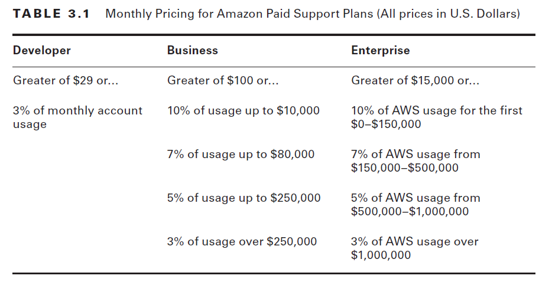
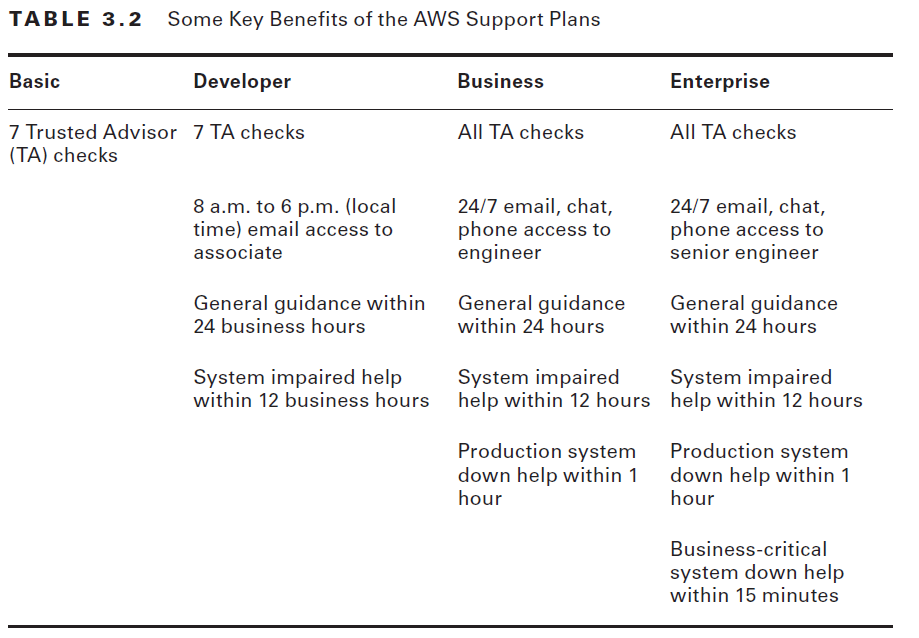
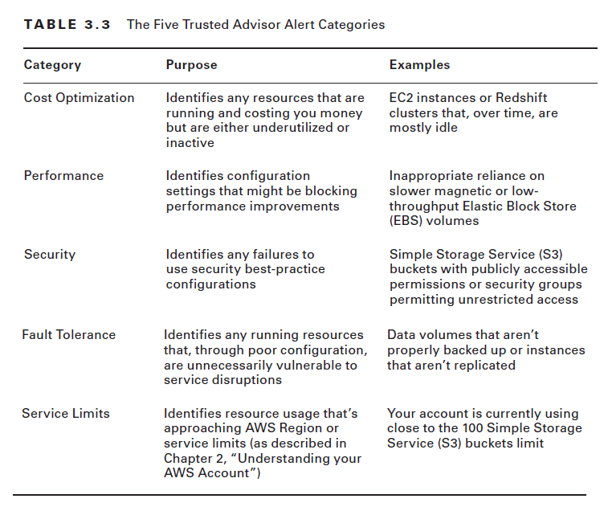
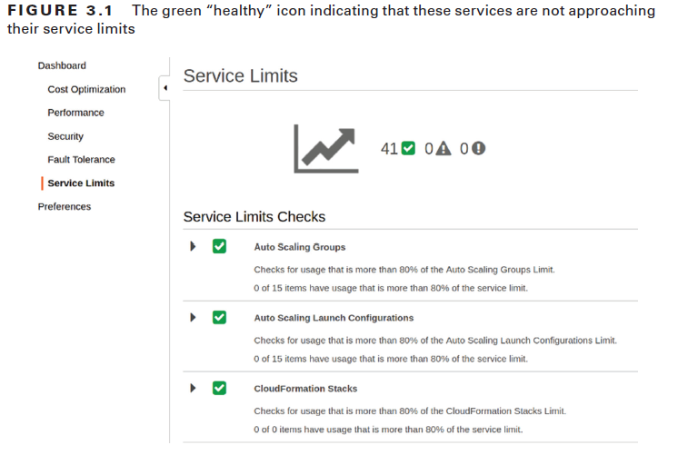

# AWS Certified Practitioner Exam

## Getting Support on AWS

### Introduction

* Preparing and securing effective on-premises server workloads can be complicated and
  stressful.
* AWS has made it easy to provision and launch robust, multilevel
  application environments.
* AWS provides layers of support designed to help you
  as you take your first confusing steps on the platform, learn about the many ways you can use
  AWS services, and struggle to optimize and secure your increasingly complex resources.
* This chapter will show you the kinds of AWS support that are available and how to find
  them.
* You’ll learn about the four AWS support plans, what professional services are available,
  what kinds of online documentation and forums are out there, and what Amazon’s
  Trusted Advisor tool is.

### Support Plans

* When you create a new AWS account, you’re required to select a support plan.
* The free Basic Support plan is always an option while you’re getting started.
* You should understand how each plan works and, more importantly, when it’s time to change to something more appropriate.

#### Support Plan Pricing

Table 3.1 shows how the price you’ll pay for support will depend on the amount
your account is billed for AWS resource usage in a given month.

Suppose a company enrolled its AWS account in the Business Support plan:
* First full month, consumed $25,000 in AWS resources.
* Since the monthly usage fell within the $10,000 to $80,000 range, it’s billed at 7 percent.
* Since the monthly usage fell within the $10,000 to $80,000 range, it’s billed at 7 percent.
  For $25,000, that’ll definitely come out higher than the $100 minimum. In fact, 7
  percent of $25,000 is $1750, which is a lot of money.

The same considerations would apply to the Enterprise Support plan at the high usage end.
* A large organization spending $750,000 each month should probably
  protect that investment with a 3 percent support “surcharge” of $22,500. That’s probably
  less than you’d pay for two experienced and competent administrators.

if you’re still in the planning stages for your project and you’re not
yet running expensive resources 24/7, you can get full Developer or Business Support for
the minimum rates ($29 or $100 per month, respectively) to help as you ramp up. That can
be a great deal.

An Enterprise Support plan will provide access to architectural and operational
reviews, recommendations, and reporting.

#### The Basic Support Plan

* On the Basic plan, you’re not paying anything beyond the regular costs of consuming AWS resources.
* You’re given access only to publicly available documentation, including white papers, tutorials, and support forums.
* You’ll be able to contact customer service at any time of the day or night for account-related issues (such
  as bill payment).
* You also get limited access to the Trusted Advisor tool.
* You’ll receive alerts concerning interruptions
  to any AWS services you’re currently using through the Personal Health Dashboard (PHD).

#### The Developer Support Plan

* AWS recommends the Developer Support plan for organizations running nonproduction
  workloads.
* An Example is a website or application that’s still in the development stages and isn’t yet handling critical transactions or heavy traffic.
* No ideal for critical applications, because your direct access to AWS cloud support associates is limited to emails during business hours and to asking
  their advice on general information about AWS use cases.
* If you are running infrastructure that simply must remain active, then you should seriously consider signing up for
  a higher support level.

#### The Business Support Plan

* The Business Support plan can meet the needs of many organizations by offering relatively
  fast and detailed answers to your technical questions.
* The Business plan guarantees a response from a cloud support engineer via email, chat, or
  phone within one hour.
* Less severe issues can take longer—up to 24 hours for what AWS calls general guidance.
* For an additional fee, you
  can also get in-depth guidance while you’re still in your project’s design stage through
  Infrastructure Event Management.
* This level of support can include help troubleshooting interoperability between AWS
  resources and third-party software and operating systems.

#### The Enterprise Support Plan

* The Enterprise plan is appropriate only for large operations whose scope is global and for whom downtime is simply
  unthinkable.
* the price tag (starting at $15,000/month)
* The detail that most stands out is the technical
  account manager (TAM) who is assigned as a dedicated “guide and advocate” for your
  account.
* Your TAM is more than just a technical resource; the TAM becomes closely
  involved in your deployment, guiding your team through planning, launches, and proactive
  reviews—all optimized using best practices.
* As your advocate within AWS, a TAM can
  open doors and make innovative solutions possible.
* Enterprise customers get 24/7 access to senior cloud support engineers
  and a 15-minute response time for business-critical troubleshooting.

More details on all AWS support plans are available at https://aws.amazon.com/
premiumsupport.

#### AWS Professional Services

* Support is also available through the AWS Professional Services organization.
* The Professional Services team provides “offerings”—detailed guides to achieving specific outcomes—and work with third-party consultants from the AWS Partner Network (APN)
  to actively help you build your deployments.
* The Professional Services team also makes
  tech talk webinars, white papers, and blog posts publicly available.

For more details, contact AWS support. You can read more about the program at
https://aws.amazon.com/professional-services.

### Documentation and Online Help

* Even if you decide not to sign up for a paid support plan, there are still many places to look
  for help—it’s just that, for the most part, it’ll be self-help.

#### Documentation

* AWS documentation page can be found at https://docs.aws.amazon.com.
* There you’ll find links to more than 100 AWS services along with tutorials and projects, software
  development kits (SDKs), toolkits, and general resources.
* you’ll usually find more links to individual documentation
  resources available as HTML (for browser viewing), PDF (offline and printing),
  Kindle (eBook), and GitHub (MarkDown formatted) versions
* One important trick—especially if you’ve landed on a page based on the
  results of an internet search engine—is to look for the word latest in the web page’s URL.
  This tells you that you’re on the page that accurately reflects the most recent version of the
  software. Here’s an example of a page that includes the latest identifier:
* https://docs.aws.amazon.com/AmazonS3/latest/user-guide/what-is-s3.html
 

#### Knowledge Center

* The AWS Knowledge Center (https://aws.amazon.com/premiumsupport/knowledge-center)
  is basically a frequently asked questions (FAQ) page
* The Knowledge Center page contains links to nearly 1,000 questions arranged by service,
  each representing a fairly common problem encountered by real AWS customers.
* Choosing a question will take you to a page with a proposed resolution and more links
  to related information.

#### Security Resources

* AWS makes it perfectly clear that it wants your deployments to be as secure as possible.
* One way it makes this easier to accomplish is by maintaining a dedicated documentation
  page with links to useful and practical security-related resources.
* The page, found at https://aws.amazon.com/security/security-resources, points to AWS blogs, white
  papers, articles, and tutorials covering topics such as security best practices and encrypting
  your data in transit and at rest.

#### Discussion Forums

* AWS discussion forums have also addressed their share of problems.

The site—found at https://forums.aws.amazon.com—is divided into categories including:
* Amazon Web Services (which is further divided into individual services), 
* AWS Startups (focused on newcomers to the platform), 
* AWS Web Site and Resources (topics like Java Development and High Performance Computing), 
* and a number of areas serving non-English speakers using languages like Japanese and German.
* You can search the entire site
  or individual forums to see whether your question might already have been answered.
* To post on the forum, you’ll need to be signed into your AWS account and have a forum
  nickname and email.

### Trusted Advisor

You use Trusted Advisor to visually confirm whether your account resource configurations
are sound and are compliant with best practices.

Trusted Advisor organizes its compliance alerts across five categories:

* The full range of Trusted Advisor alerts is only available for
  users signed on to either the Business or Enterprise Support service tier.
* For everyone else, including those on the free Basic Support plan—access is limited to service limits and some of the security alerts.
* All users are able to browse through inactive versions of the entire
  range of alerts to at least see what they’re missing. 

* For instance, you haven’t configured multifactor authentication for your root account, you’ll
get a red alert icon suggesting that you should seriously consider attending to the problem.

#### Healthy Service Limit status

### Summary

AWS requires you to select one of four support plans:

* The Basic plan is free;
* Developer starts at $29;
* Business starts at $100,
* Enterprise starts at $15,000

* The higher the support level, the more responsive and personalized the technical troubleshooting
  and planning support you get.
* The Developer Support plan is aimed at organizations still testing and planning deployments.
* The Business Support plan is for smaller operations running relatively light production
  infrastructure.
* The Enterprise Support plan is ideal for large production deployments
  with a global footprint that cannot tolerate downtime.

### Summary

* AWS provides exhaustive and regularly updated documentation using multiple styles
  across a number of web platforms. Those include user guide documentation pages, the
  Knowledge Center, resources specific to security, and discussion forums.

* The AWS Trusted Advisor alerts users to the best-practice compliance of their running
  account resources.
* Basic Support and Developer Support plan users get service limit and
  some security information;
* Business and Enterprise customers get access to all alerts.

### Exam Essentials

**Know how to choose a support plan that reflects your operational needs.**
* The more complex and expensive your AWS deployments get, the more costly a configuration mistake
becomes. 
* You can think about more expensive AWS support levels much the same way you already think about hiring experienced and reliable admins. 
* Whatever it takes to design and deploy a lean and security-hardened application is a justifiable business expense.

**Understand the benefits of the Enterprise Support plan’s technical account manager (TAM).`**
* The ongoing, personalized attention your account deployments receive from a TAM can
make a significant difference in the quality of support.
* There’s nothing like having an expert insider involved in the planning and execution of your complex infrastructure.

**Understand how to find AWS resource usage guidance through official AWS documentation.**
* The AWS user guides are available in multiple formats (including HTML, PDF, Kindle,
and, on GitHub, MarkDown) and 
* Methodically explain practical usage for AWS services at all levels. The Knowledge Center is a large collection of FAQs covering hundreds of common
problems and their solutions.

**Understand how to use Trusted Advisor for alerts to common system misconfigurations.**
The Trusted Advisor alerts are divided into five categories: 
* Cost Optimization, 
* Performance,
* Security,
* Fault Tolerance,
* and Services Limits.

You should set up an administration routine that includes regular visits to the Trusted Advisor to see whether any important status checks
have changed.