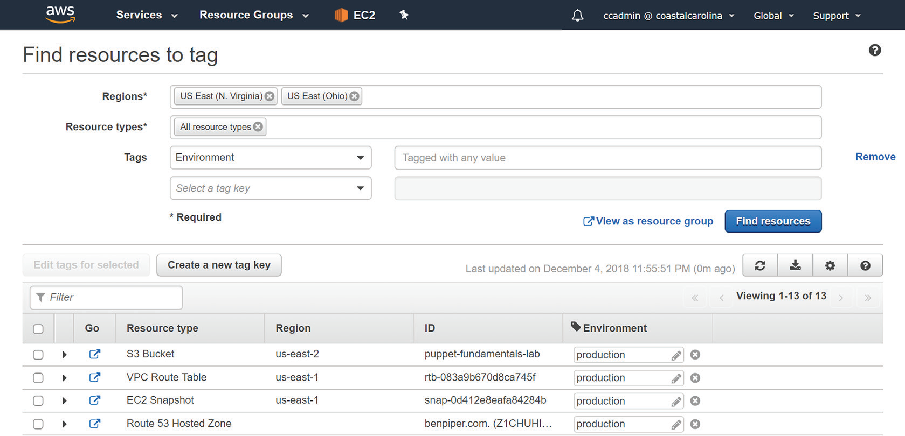

# AWS Certified Practitioner Exam

## Working with your aws resources

### Introduction

* The primary way you’ll interact with AWS services is through the AWS Management
  Console;
* You’ll also learn about the AWS Console Mobile Application, which allows you
  to view and manage some of your AWS resources from an Android or iOS mobile device.
* you’ll learn how to use the AWS Command Line Interface (AWS CLI)
  to perform configurations and view information about your AWS resources from the
  command line of your favorite desktop operating system.
* You’ll then learn how to use CloudWatch to monitor the performance of your resources,
  create alarms that notify you when things aren’t working right, and collect, view, and
  search logs from your applications and AWS services.
* you’ll learn how CloudTrail works to keep a detailed log of every action that
  anyone or anything performs against your AWS resources. CloudTrail is a key security
  service that’s essential for validating that your AWS account is secure and that services are
  configured and working properly.
* you’ll learn how to use Cost Explorer to understand what your AWS services are
  costing you, spot usage and billing trends over time, and get recommendations to help you
  save money.

### The AWS Management Console

* AWS Web Console, is a web interface you can use to manage all of your AWS cloud resources using a
  web browser, including compute, storage, and networking.

To access the AWS Management Console, browse to https://console.aws.amazon.com
in your web browser. There are two ways to sign in: as the root user or as an Identity and
Access Management (IAM) user.

*Once you’re logged in, your session will remain active for 12 hours.

* Choosing the Services link at the top of the AWS Management Console
  will let you search for a service by name in the search box, or you can browse services
  grouped by type, such as compute, storage, and database, as shown in Figure 6.4

* Most AWS services are region-specifi c. For example, the EC2 service in the US East region
  is separate from the EC2 service in the US West region.
* Some services such as IAM, Route 53, and S3 are global.

#### The Account Name Menu

Choosing the menu gives you the following options:
My Account—Takes you to the Billing service console page that displays your account
information
* My Organization—Takes you to the AWS Organizations service console
* My Billing Dashboard—Takes you to the Billing and Cost Management Dashboard
* My Security Credentials—Takes you to the My Password page in the IAM service console
where you can change your password
* Switch Role—Lets you assume an IAM role where you can perform tasks as a different
principal with different permissions
* Sign Out—Signs you out of the AWS Management Console

#### Resource Groups

* Resource groups let you view, manage, and automate tasks on multiple AWS resources
at a time. 
* They are ideal for grouping AWS resources that all compose a particular application.
* Rather than having to remember which resources belong to which application, you
can add those resources to a resource group and let AWS remember for you! 
* You can then perform bulk actions against those resources.

* A resource group is a collection of AWS resources in the same region that match the
results of a query. 
* You can create a resource group from a query based on resource tags or
from a CloudFormation Stack.

`Resource tags` are optional metadata that you can assign to AWS resources. A tag must contain a label called a key and may optionally contain a value.
* Tag keys and values can include letters, numbers, spaces, and these characters: + - = . _ : / @.

* Tag keys and values are case-sensitive. 
* To create a resource group using tags, you can query based on a tag key only or both a tag key and its value.

`CloudFormation`, which you’ll learn about in Chapter 11, “Automating Your AWS Workloads,” lets you programmatically deploy and manage multiple
AWS resources as a single unit called a stack.

* You can create resource groups that contain
  some or all of the resources in a CloudFormation stack.
* You can choose all resources in the
  stack or filter by resource type, such as EC2 instance, EC2 security group, or S3 bucket.

#### Tag Editor

* If you want to create a resource group based on tags, you’ll first need to tag the resources
  you want to include in the group.
* Choose the Resource Groups link in the navigation bar of the AWS Management
  Console, and then choose Tag Editor
* To get started with Tag Editor, create a query to find the resources you want to tag.
* At a minimum, you must select at least one region and one or more resource types, such
  as EC2 instances, EC2 volumes, VPCs, or S3 buckets.
* Optionally, you can list resources that already have an existing tag.

#### Tagging Strategies

you can use tags to organize resources along the following broad categories: technical, automation, business, and security.

##### Technical

* One tagging strategy is to tag according to technical properties of a resource.
* you may tag an EC2 instance hosting a web server with the Name tag and a value of webserver01 .
* Many AWS service consoles recognize the Name tag and display it alongside resources such as EC2
  instances, EBS volumes, and VPC security groups.
* Tags don’t have to be unique, so it’s possible to inadvertently give different resources a Name tag with the
  same value.
* You can use the Environment tag to specify whether the resource is part of your production,
  test, or development infrastructure.
* You may also want to create an Application role tag to classify the type of role a
  resource performs. For example, you may tag an EC2 instance with a value of web server
  or database server, depending on its function.

##### Automation

* Automation tags can be used to define the resources that should be part of an automation
  process.
* Some automation processes may include updating security patches on an instance,
  taking backups, deleting old snapshots, or turning off development servers after hours.
* You might specify Date or Time tags to specify when automation tasks should occur on a
  resource.
* You may also specify Opt in or Opt out tags as flags to enable or disable automation
  on particular resources.

##### Business

* In an organization where AWS is being used for multiple projects or by different departments,
  it can be helpful to group resources into categories that the business can use for billing,
  management, and analysis.

* Owner to identify the person or group responsible for the resource
* Business Unit or Cost Center to indicate who’s responsible for paying for the
resource
* Project to identify the name of the program or project the resource is a part of
* Customer to identify resources that are dedicated to a particular customer.

##### Security

* Conditions in IAM policies can look at resource tags to determine whether to allow a particular
  action.
* you can specify a condition that permits an EC2 instance to
  access a production database only if the instance has the Environment tag with the value
  Production.
* Other instances tagged with a different value or no Environment tag at all
  would be denied access to the database.
* In environments with strict security requirements, you may need to tag resources according
  to the confidentiality level of data they process or their compliance requirements.
* `Confidentiality` If your resources process or store data that has varying confidentiality
  requirements, you may use resource tags to designate that.
* `Compliance` If any of your resources must adhere to specific compliance requirements.

### The AWS Console Mobile Application

The AWS Console Mobile Application is a smartphone application that lets you manage
your AWS account and resources on the go.

The application features a dashboard showing
key information about your AWS account and resources, including the following:

* Service Health—View any current health issues with AWS services across different regions.
* CloudWatch Alarms—View alarm graphs and current alarm status.
* View your current billing balance and a graph of usage charges.

You can use the application to make limited changes to some AWS resources, including
CloudWatch Alarms, EC2 security groups, EC2 instances, and CloudFormation stacks.

You can stop or reboot an EC2 instance.

#### Supported Services

* AWS Billing and Cost Management
* AWS CloudFormation
* Amazon CloudWatch
* Amazon DynamoDB
* Amazon EC2
* AWS Elastic Beanstalk
* Elastic Load Balancing
* AWS OpsWorks
* AWS Personal Health Dashboard
* Amazon Relational Database Service (Amazon RDS)
* Amazon Route 53
* Amazon Simple Storage Service (Amazon S3)
* Amazon Virtual Private Cloud (Amazon VPC)

#### Requirements

You can authenticate in any of the following ways:

* Root account credentials (remember that it’s a best practice to avoid using the root
account)
* An IAM username and password
* An access key ID and secret key

* The application is especially convenient for looking up important information on the
  go. For instance, you can quickly see how an S3 bucket policy is configured.

### The AWS Command Line Interface

* The AWS Command Line Interface (AWS CLI) is a unified command-line tool to manage
  your AWS resources.
* AWS gives access to the public application programming interfaces for all AWS services
  within 180 days of service launch.
* Anything you can do in the AWS Management Console,
  you can do from your terminal using the AWS CLI.

You can enter AWS CLI commands manually for convenience, or you can incorporate them into a script for automation.
For example, you can write a reporting script that shows you your S3 buckets or all running
EC2 instances.

#### Requirements

The AWS CLI is compatible with Windows, macOS, and Linux. To connect to AWS using
the CLI, your network should allow outbound access to the internet on TCP port 443.
You’ll also need an IAM access key ID and secret key to authenticate to AWS using the
CLI. Refer to Chapter 5 for details on creating an IAM access key ID and secret key.

* Installation Using Python and Pip
* Installation Using the Stand-Alone Installer

For Windows, use the MSI installer that includes setup packages for Windows 64-bit
and 32-bit architectures. You can download the setup MSI at https://s3.amazonaws.com/
aws-cli/AWSCLISetup.exe.

* Test that the AWS CLI works by issuing the aws --version command.
* In the AWS Management Console, generate an access key ID and secret key for an
  IAM user.
* run the command `aws configure` and enter the access key ID and
  secret key from step 2 when prompted.
* Enter the AWS Region you want the AWS CLI to default to, such as us-east-1.
* Enter the default output format, which can be json, text, or table. Note that this is
  case-sensitive.

Try testing the CLI by issuing the following command to display a list of IAM access keys:
aws iam list-access-keys.

### Software Development Kits

* AWS software development kits simplify the use of AWS services in custom applications.
* Application developers can use an SDK to integrate their applications with AWS services
easily and reliably.

* SDKs save application developers from having to write low-level code to
  interact directly with the AWS service API endpoints.

#### Mobile Software Development Kits

* AWS Mobile SDK for Android.
* AWS Mobile SDK for iOS.
* AWS Mobile SDK for Unity, a popular engine for creating games that can run on both
  iOS and Android.
* AWS Mobile SDK for .NET and Xamarin, which are cross-platform application development
  frameworks that can you can use to develop applications for iOS and Android.
* AWS Amplify, which is an open source framework to build mobile and web applications
  on AWS.

#### Internet of Things Device Software Development Kits

* You can use the AWS IoT SDKs to create applications that run on Internet of Things (IoT)
  devices, such as sensors, microcontrollers, smart appliances, smart lightbulbs, and AWS IoT
  buttons.
* Using the AWS IoT SDKs and the AWS IoT platform, applications running on these
  devices can integrate with other AWS services, including the following:
  * Amazon S3
  * Amazon DynamoDB
  * Amazon Kinesis
  * AWS Lambda
  * Amazon Simple Notification Service
  * Amazon Simple Queue Service

### CloudWatch

* Amazon CloudWatch is a key service that helps you plan, monitor, and fine-tune your
  AWS infrastructure and applications.
* It lets you collect, search, and visualize data from
  your applications and AWS resources in the form of logs, metrics, and events.

`Infrastructure monitoring and troubleshooting` Visualize performance metrics to discover
trends over time and spot outliers that might indicate a problem. Correlate metrics and logs
across your application and infrastructure stacks to understand the root cause of failures
and performance issues.

`Resource optimization` Save money and help with resource planning by identifying overused
or underused resources. Ensure performance and availability by using AWS Auto
Scaling to automatically provision new EC2 instances to meet demand.

`Application monitoring` Create CloudWatch alarms to alert you and take corrective action
when a resource’s utilization, performance, or health falls outside of a threshold that you define.

`Log analytics` Search, visualize, and correlate logs from multiple sources to help with
troubleshooting and identify areas for improvement.

#### CloudWatch Metrics

* CloudWatch Metrics is a feature that collects numeric performance metrics from both AWS
  and non-AWS resources such as on-premises servers.
* A metric is a variable that contains a timeordered
  set of data points. Each data point contains a timestamp, a value, and optionally a unit of
  measure.
* All AWS resources automatically send their metrics to CloudWatch. These metrics include
  things such as EC2 instance CPU utilization, S3 bucket sizes, and DynamoDB consumed
  read and write capacity units.
* CloudWatch stores metrics for up to 15 months.

#### CloudWatch Alarms

* A CloudWatch alarm watches over the value of a single metric.
* If the metric crosses a
  threshold that you specify (and stays there), the alarm will take an action.
* For example,  you might configure an alarm to take an action when the average CPU utilization for an
  instance exceeds 80% for five minutes.

The action can be one of the following:

* Notification using Simple Notification Service;
  * The Simple Notification Service (SNS)
    allows applications, users, and devices to send and receive notifications from AWS. SNS
    uses a publisher-subscriber model, wherein a publisher such as an AWS service generates a
    notification and a subscriber such as an end user receives it. The communication channel
    that SNS uses to map publishers and subscribers is called a topic. SNS can send notifications
    to subscribers via a variety of protocols including the following:
    * HTTP(S)
    * Simple Queue Service (SQS)
    * Lambda
    * Mobile push notification
    * Email
    * Email-JSON
    * Short Message Service (SMS) text messages
* Auto Scaling action;
  * By specifying an EC2 Auto Scaling action, the EC2 Auto Scaling service
    can add or remove EC2 instances in response to changing demand. For example, if a
    metric indicates that instances are overburdened, you can have EC2 Auto Scaling respond
    by adding more instances.
* EC2 action;
  * If you’re monitoring a specific instance that’s having a problem, you can use
    an EC2 action to stop, terminate, or recover the instance. Recovering an instance migrates
    the instance to a new EC2 host, something you may need to do if there’s a physical hardware
    problem on the hardware hosting the instance.
  
#### CloudWatch Dashboards

* CloudWatch dashboards are your one-stop shop for keeping an eye on all of your important
  metrics.
* You can create multiple dashboards and add to them metric graphs, the latest
  values for a metric, and CloudWatch alarms.
* You can save your dashboards for future use and share them with others.
* Dashboards can also visualize metrics from multiple AWS
  Regions, so you can keep an eye on the global health of your infrastructure.

### CloudWatch Logs

CloudWatch Logs collects and stores log files from AWS and non-AWS sources and makes
it easy to view, search, and extract custom metrics from them.

#### Log Events, Streams, and Groups

* You configure your applications and AWS services to send log events to CloudWatch Logs.
* A log event is analogous to a line in a log file and always contains a timestamp and an
event message.
* Many AWS services produce their own logs called vended logs that you can
  stream to CloudWatch Logs. Such logs include Route 53 DNS query logs, VPC flow logs,
  and CloudTrail logs.
* CloudWatch Logs can also receive custom logs from your applications,
  such as web server access logs.
* CloudWatch further organizes log streams into log groups. To organize related log
  streams, you can place them into the same log group. For instance, if you have several log
  streams that are collecting web server log events from multiple web servers, you can group
  all of those log streams into a single log group.
* CloudWatch Logs stores log events indefinitely by default, but you can configure a log
  group’s retention settings to delete events automatically. Retention settings range from
  1 day to 10 years. You can also archive your logs by exporting them to an S3 bucket.

#### Metric Filters

* A metric filter extracts data from log events in a log group and stores that data in a custom
CloudWatch metric. For example, suppose a log event from a database server contains the
time in milliseconds it takes to run a query. You may extract that value and store it as a
CloudWatch metric so you can graph it and create an alarm to send a notifi cation when it
exceeds a certain threshold.
* You can also use metric filters to track the number of times a particular string occurs.
  This is useful for counting the number of times a particular event occurs in a log, such as
  an error code.

#### CloudWatch Events

The CloudWatch Events feature lets you continuously monitor for specifi c events that represent
a change in your AWS resources—particularly write-only API operations—and take an
action when they occur.

For example, an EC2 instance going from the running state to the
stopped state would be an event. An IAM user logging into the AWS Management Console
would also be an event. CloudWatch Events can then automatically and immediately take
actions in response to those events.

You start by creating a rule to defi ne the events to monitor, as well as the actions you
want to take in response to those events. You defi ne the action to take by selecting a target,
which is an AWS resource. Some targets you can choose from include the following:
* Lambda functions
* EC2 instances
* SQS queues
* SNS topics
* ECS tasks

CloudWatch responds to events as they occur, in real time. Unlike CloudWatch alarms,
which take action when a metric crosses and remains crossing a numeric threshold,
CloudWatch events trigger immediately.

For example, you can create a CloudWatch event
to send an SNS notifi cation whenever an EC2 instance terminates. Or you could trigger a
Lambda function to process an image fi le as soon as it hits an S3 bucket.

you can create a schedule to automatically perform actions at regular
intervals. For example, to save money you might create a schedule to shut down development
instances every day at 7 p.m., after the developers have ideally stopped working!

### Cloud Trail

CloudTrail keeps detailed event logs of every action that occurs against your AWS
resources.

Each event that CloudTrail logs includes the following parameters:
* The service. Specifically, this is the address of the service’s global endpoint, such as
  iam.amazonaws.com for IAM.
* The name of the API action performed, such as RunInstances, CreateUser, or
  PutObject.
* The region the resource is located in. For global services, this is always us-east-1.
* Response elements. In the case of an API operation that changes or creates a resource,
  this contains information about the results of the action. For example, the response
  elements for a RunInstances action to launch an EC2 instance would yield information
  such as the instance ID and private IP address.
* The principal that made the request. This may include the type of principal (IAM user
  or role), its Amazon resource name (ARN), and the name.
* The date and time of the request, given in coordinated universal time (UTC).
* The IP address of the requester.

#### API and Non-API Events

API actions include things such as launching an instance, creating an S3 bucket, creating a new
IAM user, or taking an EBS snapshot. Note that the term API action has nothing to do
with how the action was performed.

CloudTrail also classifies events along two other dimensions: management events and data
events.

`Management events`—also known as control plane operations—are operations that
a principal (such as a user or service) attempts to execute against an AWS resource.
Management events include write-only events—API operations that modify or might modify resources,
and read-only events that read resource information but don’t make any
changes.

`Data events` consist of S3 object-level activity and Lambda function executions, both of
which tend to be high volume. As such, CloudTrail treats data events as separate from management
events. And when it comes to S3 object-level operations, CloudTrail draws a distinction
between read-only events like GetObject and write-only events such as PutObject
and DeleteObject .

#### Event History

When you open an AWS account, CloudTrail begins logging all of your management
events automatically. It stores 90 days of management events in the event history, which
you can view, search, and download at any time.

For each region, CloudTrail maintains a separate event history log containing the events
that occurred in that region. But events generated by global services including IAM and
Route 53 are included in the event history for every region.

#### Trails

If you want to customize the types of events CloudTrail logs—such as specifi c management
or data events—or if you need to store more than 90 days of event history, you need to create
a trail.

A trail is a confi guration that directs CloudTrail to record specifi ed events in log
fi les and deliver them to an S3 bucket. A trail can log events from either a single region or
all regions. You can choose to log management events, data events, or both. You can also
choose whether to log read-only or write-only events, or both.

CloudTrail doesn’t provide a way to search trail logs, which are written in JavaScript
Object Notation (JSON) format. But you can download the log fi les directly from S3. You
can also confi gure CloudTrail to send a trail log to CloudWatch Logs, making them available
for storage, searching, and metric fi ltering.

#### Log File Integrity Validation

CloudTrail doesn’t provide a way to search trail logs, which are written in JavaScript
Object Notation (JSON) format. But you can download the log fi les directly from S3. You
can also confi gure CloudTrail to send a trail log to CloudWatch Logs, making them available
for storage, searching, and metric fi ltering.

If anyone modifies the file, even by one bit, the hash of the modified file will be completely different
than the original hash. This can tell you whether anyone has tampered with the log file, but
it can’t tell you exactly how it’s been modified.

Log files can be encrypted using server-side encryption with Amazon S3-managed
encryption keys (SSE-S3) or server-side encryption with AWS KMS-managed keys
(SSE-KMS).

### Cost Explorer

AWS Cost Explorer is a feature of AWS Billing and Cost Management that offers configurable reports and graphs
to help you understand how each of your AWS services impacts your monthly bill.

AWS Cost Explorer offers the following three categories of reports:

* Cost and usage reports
* Reservation reports
* Reserved instance recommendations

#### Cost and Usage

You can generate cost and usage reports to give you a graphical view of your daily and
monthly costs and usage over time.

Cost Explorer offers the following five default cost and usage reports:

* Monthly costs by service
* Monthly costs by linked account
* Monthly EC2 running hours costs and usage
* Daily costs
* AWS marketplace

#### Reservation Reports

Cost Explorer offers the following two built-in reservation reports to give you insight on
how much you are saving—or could have saved—with instance reservations.

Instance reservations
allow you to save money by prepaying for compute instances including those used
by Amazon EC2, Amazon Elasticsearch Service, Amazon ElastiCache, Amazon RDS, and
Amazon Redshift. 

`The Reserved Instances (RI) Utilization report` shows you the percentage of your reserved
instances you’ve used and how much money you’ve saved or overspent by using reserved
instances.

The RI Utilization report also shows you your net savings from reserved
instances, giving you insight into whether you’ve had too few or too many reserved
instances.

`The Reserved Instances Coverage report` tells you how many of your running instance hours
are covered by instance reservations, how much you’ve spent for on-demand instances, and
how much you could have saved by purchasing reserved instances.

Cost Explorer can provide reserved instance recommendations to help reduce your costs.

Cost Explorer analyzes your on-demand instance
usage over the past 7, 30, or 60 days. It then searches for all available reserved instances
that would cover that usage. Finally, it selects the most cost-effective reserved instances and
recommends them.

Costs Explorer makes recommendations separately for each service such as EC2 or RDS.
You can also customize the recommendations by selecting a reserved instance term and
payment option.

### Summary

CloudWatch collects metrics from AWS services. You can create alarms to take some
action, such as a notification, when a metric crosses a threshold. CloudWatch receives and
stores logs from AWS and non-AWS services and even extracts metrics from those logs
using metric filters.

CloudTrail records events that occur against your AWS account. By default, the
CloudTrail event history log captures the last 90 days of management events in each region.
If you want to log more than this or customize the events that it logs, you must create a
trail to cause CloudTrail to store events in an S3 bucket. You can also configure a trail to
stream logs to CloudWatch Logs for storage, viewing, and searching.

### Exam Essentials

The Management Console is required if you want to use the point-and-click interface and want
to view visual elements such as CloudWatch graphs or Cost Explorer graphs.

The AWS CLI is what you’ll use to manage your AWS resources manually from the command
line or using scripts. It’s good for repetitive or bulk tasks that would take a long time using
the Web. To use the CLI, you need an access key ID and secret key.

Resource tags are keys associated
with your AWS resources. A key can optionally contain a value. You can use tags
to label your resources according to whatever you like, be it owner, business unit, or environment.
You can group resources into a resource group according to resource tags or
CloudFormation stacks.

CloudWatch can collect logs and metrics
from AWS and non-AWS services. Many AWS services such as EC2 automatically send
metric data to CloudWatch. You can create alarms to trigger when a metric falls above or
below a threshold. In response to an alarm, you can send a notification using SNS, or you
can take an action using an Auto Scaling action or EC2 action. You can also graph metrics
to view trends visually. CloudWatch Logs lets you aggregate and search log files. Some services,
such as VPC and Route 53, can be configured to stream vended logs to CloudWatch
logs. You can extract metrics from these logs using metric filters. CloudWatch events
let you take actions in response to specific events that occur with your AWS resources,
such as launching an EC2 instance or creating an S3 bucket. Unlike alarms that are triggered
by metrics crossing a threshold, CloudWatch Events acts in response to specific API
operations.

AWS offers SDKs
for a variety of programming languages and platforms. You can use the SDKs to quickly
develop desktop, server, web-based, or mobile apps that use AWS services. Although many
AWS services offer the HTTPS-based AWS Query API that you can interface with directly,
the SDKs handle the heavy lifting of request authentication, serialization, and connection
management, freeing you up to write your application without having to learn the nittygritty
API details of every AWS service you want to use.

CloudTrail logs management and data operations on your account. By
default, it logs 90 days of management events per region. If you want to log more than this
or customize which events it logs, you can create a trail to log those events and store them
in an S3 bucket. You can optionally stream CloudTrail logs to CloudWatch for storage,
searching, and analysis.