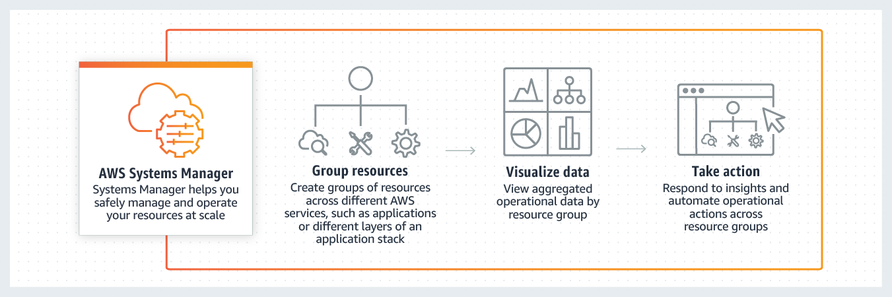

# AWS Certified Practitioner Exam

## Exam 01

**Question 1**

1. A silicon valley based healthcare startup stores anonymized patient health data on Amazon S3. The CTO further wants to ensure that any sensitive data on S3 is discovered and identified to prevent any sensitive data leaks. As a Cloud Practitioner, which AWS service would you recommend addressing this use-case?
*  A. AWS Secrets Manager
*  B. Amazon Macie
*  C. AWS Glue
*  D. Amazon Polly

**Answer** B

**Explanation**

 
Correct option:

 
<strong>Amazon Macie</strong> - Amazon Macie is a fully managed data security and data privacy service that uses machine learning and pattern matching to discover and protect your sensitive data in AWS. Macie automatically provides an inventory of Amazon S3 buckets including a list of unencrypted buckets, publicly accessible buckets, and buckets shared with AWS accounts outside those you have defined in AWS Organizations. Then, Macie applies machine learning and pattern matching techniques to the buckets you select to identify and alert you to sensitive data, such as personally identifiable information (PII).

 
How Macie Works:  via - <a href="https://aws.amazon.com/macie/">https://aws.amazon.com/macie/</a>

 
Incorrect options:

 
<strong>AWS Glue</strong> - AWS Glue is a fully managed extract, transform, and load (ETL) service that makes it easy for customers to prepare and load their data for analytics. AWS Glue job is meant to be used for batch ETL data processing. It cannot be used to discover and protect your sensitive data in AWS.

 
<strong>Amazon Polly</strong> - Amazon Polly is a service that turns text into lifelike speech, allowing you to create applications that talk, and build entirely new categories of speech-enabled products. Polly's Text-to-Speech (TTS) service uses advanced deep learning technologies to synthesize natural sounding human speech. It cannot be used to discover and protect your sensitive data in AWS.

 
<strong>AWS Secrets Manager</strong> - AWS Secrets Manager helps you protect secrets needed to access your applications, services, and IT resources. The service enables you to easily rotate, manage, and retrieve database credentials, API keys, and other secrets throughout their lifecycle. Users and applications retrieve secrets with a call to Secrets Manager APIs, eliminating the need to hardcode sensitive information in plain text. It cannot be used to discover and protect your sensitive data in AWS.

 
Reference:

 
<a href="https://aws.amazon.com/macie/">https://aws.amazon.com/macie/</a>

**Question 2**

2. A unicorn startup is building an analytics application with support for a speech-based interface. The application will accept speech-based input from users and then convey results via speech. As a Cloud Practitioner, which solution would you recommend for the given use-case?
*  A. Use Amazon Transcribe to convert speech to text for downstream analysis. Then use Amazon Polly to convey the text results via speech
*  B. Use Amazon Translate to convert speech to text for downstream analysis. Then use Amazon Polly to convey the text results via speech
*  C. Use Amazon Polly to convert speech to text for downstream analysis. Then use Amazon Translate to convey the text results via speech
*  D. Use Amazon Polly to convert speech to text for downstream analysis. Then use Amazon Transcribe to convey the text results via speech

**Answer** A

**Explanation**

 
Correct option:

 
<strong>Use Amazon Transcribe to convert speech to text for downstream analysis. Then use Amazon Polly to convey the text results via speech</strong>

 
You can use Amazon Transcribe to add speech-to-text capability to your applications. Amazon Transcribe uses a deep learning process called automatic speech recognition (ASR) to convert speech to text quickly and accurately. Amazon Transcribe can be used to transcribe customer service calls, to automate closed captioning and subtitling, and to generate metadata for media assets.

 
Amazon Transcribe Use-Cases:  via - <a href="https://aws.amazon.com/transcribe/">https://aws.amazon.com/transcribe/</a>

 
You can use Amazon Polly to turn text into lifelike speech thereby allowing you to create applications that talk. Polly's Text-to-Speech (TTS) service uses advanced deep learning technologies to synthesize natural sounding human speech.

 
Amazon Polly Benefits:  via - <a href="https://aws.amazon.com/polly/">https://aws.amazon.com/polly/</a>

 
Amazon Translate is used for language translation. Amazon Translate uses neural machine translation via deep learning models to deliver more accurate and more natural-sounding translation than traditional statistical and rule-based translation algorithms.

 
Incorrect options:

 
<strong>Use Amazon Polly to convert speech to text for downstream analysis. Then use Amazon Transcribe to convey the text results via speech</strong> - Amazon Polly cannot be used to convert speech to text, so this option is incorrect.

 
<strong>Use Amazon Translate to convert speech to text for downstream analysis. Then use Amazon Polly to convey the text results via speech</strong> - Amazon Translate cannot convert speech to text, so this option is incorrect.

 
<strong>Use Amazon Polly to convert speech to text for downstream analysis. Then use Amazon Translate to convey the text results via speech</strong> - Amazon Polly cannot be used to convert speech to text, so this option is incorrect.

 
References:

 
<a href="https://aws.amazon.com/transcribe/">https://aws.amazon.com/transcribe/</a>

 
<a href="https://aws.amazon.com/polly/">https://aws.amazon.com/polly/</a>

**Question 3**

3. Which security service of AWS is enabled for all AWS customers, by default, at no additional cost?
*  A. AWS Shield Standard
*  B. AWS Secrets Manager
*  C. AWS Web Application Firewall (AWS WAF)
*  D. AWS Shield Advanced

**Answer** A

**Explanation**

 
Correct option:

 
<strong>AWS Shield Standard</strong>

 
AWS Shield Standard defends against most common, frequently occurring network and transport layer DDoS attacks that target your website or applications. While AWS Shield Standard helps protect all AWS customers, you get better protection if you are using Amazon CloudFront and Amazon Route 53. All AWS customers benefit from the automatic protections of AWS Shield Standard, at no additional charge.

 
Incorrect options:

 
<strong>AWS Web Application Firewall (AWS WAF)</strong> - AWS WAF is a web application firewall that lets you monitor the HTTP(S) requests that are forwarded to an Amazon CloudFront distribution, an Amazon API Gateway API, or an Application Load Balancer. AWS WAF charges based on the number of web access control lists (web ACLs) that you create, the number of rules that you add per web ACL, and the number of web requests that you receive (it is not a free service).

 
<strong>AWS Secrets Manager</strong> - AWS Secrets Manager helps you protect secrets needed to access your applications, services, and IT resources. The service enables you to easily rotate, manage, and retrieve database credentials, API keys, and other secrets throughout their lifecycle. With Secrets Manager, you pay based on the number of secrets stored and API calls made.

 
<strong>AWS Shield Advanced</strong> - AWS Shield Advanced includes intelligent DDoS attack detection and mitigation for not only for network layer (layer 3) and transport layer (layer 4) attacks but also for application layer (layer 7) attacks. AWS Shield Advanced is a paid service that provides additional protections for internet-facing applications.

 
Reference: https://docs.aws.amazon.com/waf/latest/developerguide/shield-chapter.html

**Question 4**

4. Which of the following AWS services support VPC Endpoint Gateway for a private connection from a VPC? (Select two)
*  A. Amazon EC2
*  B. Amazon SQS
*  C. Amazon SNS
*  D. S3
*  E. DynamoDB

**Answer** D, E

**Explanation**

 
Correct option:

 
<strong>S3</strong>

 
<strong>DynamoDB</strong>

 
A VPC endpoint enables you to privately connect your VPC to supported AWS services and VPC endpoint services powered by AWS PrivateLink without requiring an internet gateway, NAT device, VPN connection, or AWS Direct Connect connection. Instances in your VPC do not require public IP addresses to communicate with resources in the service. Traffic between your VPC and the other service does not leave the Amazon network.

 
There are two types of VPC endpoints: interface endpoints and gateway endpoints.

 
An interface endpoint is an elastic network interface with a private IP address from the IP address range of your subnet that serves as an entry point for traffic destined to a supported service. Interface endpoints are powered by AWS PrivateLink, a technology that enables you to privately access services by using private IP addresses.

 
A gateway endpoint is a gateway that you specify as a target for a route in your route table for traffic destined to a supported AWS service. The following AWS services are supported:

 
Amazon S3

 
DynamoDB

 
Exam Alert:

 
You may see a question around this concept in the exam. Just remember that only S3 and DynamoDB support VPC Endpoint Gateway. All other services that support VPC Endpoints use a VPC Endpoint Interface.

 
Incorrect options:

 
<strong>Amazon EC2</strong>

 
<strong>Amazon SQS</strong>

 
<strong>Amazon SNS</strong>

 
As explained earlier, these services support VPC Endpoint Interfaces.

 
Reference:

 
<a href="https://docs.aws.amazon.com/vpc/latest/userguide/vpc-endpoints.html">https://docs.aws.amazon.com/vpc/latest/userguide/vpc-endpoints.html</a>

**Question 5**

5. What are the advantages that AWS Cloud offers over a traditional on-premises IT infrastructure? (Select two)
*  A. Trade capital expense for variable expense
*  B. Eliminate guessing on your infrastructure capacity needs
*  C. Increase speed and agility by keeping servers and other required resources ready before time in your data centers
*  D. Make a capacity decision before deploying an application, to reduce costs
*  E. Provide lower latency to applications by maintaining servers on-premises

**Answer** A, B

**Explanation**

 
Correct options:

 
<strong>Trade capital expense for variable expense</strong> - In a traditional on-premises environment, you have to invest heavily in data centers and servers before you know how you’re going to use them. With Cloud Computing, you can pay only when you consume computing resources, and pay only for how much you consume.

 
<strong>Eliminate guessing on your infrastructure capacity needs</strong> - When you make a capacity decision before deploying an application, you often end up either sitting on expensive idle resources or dealing with limited capacity. With Cloud Computing, these problems go away. You can access as much or as little capacity as you need, and scale up and down as required with only a few minutes’ notice. You can Stop guessing capacity.

 
Incorrect options:

 
<strong>Make a capacity decision before deploying an application, to reduce costs</strong> - As explained above, when you make a capacity decision before deploying an application, you often end up either sitting on expensive idle resources or dealing with limited capacity.

 
<strong>Provide lower latency to applications by maintaining servers on-premises</strong> - Maintaining servers on-premises involves costly capital expenses and costly ongoing expenses to maintain, manage and upgrade them.

 
<strong>Increase speed and agility by keeping servers and other required resources ready before time in your data centers</strong> - This again is indicative of maintaining on-premises infrastructure which is neither a cost-effective or time effective way of managing the resources.

 
Reference:

 
<a href="https://docs.aws.amazon.com/whitepapers/latest/aws-overview/six-advantages-of-cloud-computing.html">https://docs.aws.amazon.com/whitepapers/latest/aws-overview/six-advantages-of-cloud-computing.html</a>

**Question 6**

6. Which of the following are the storage services offered by the AWS Cloud? (Select two)
*  A. S3
*  B. EFS
*  C. EC2
*  D. SQS
*  E. SNS

**Answer** A, B

**Explanation**

 
Correct options:

 
<strong>S3</strong> - Amazon Simple Storage Service (Amazon S3) is an object storage service that offers industry-leading scalability, data availability, security, and performance.

 
<strong>EFS</strong> - Amazon Elastic File System (Amazon EFS) provides a simple, scalable, fully managed elastic NFS file system for use with AWS Cloud services and on-premises resources. It is built to scale on-demand to petabytes without disrupting applications, growing and shrinking automatically as you add and remove files, eliminating the need to provision and manage capacity to accommodate growth.

 
Incorrect options:

 
<strong>EC2</strong> - Amazon EC2 is a web service that provides secure, resizable compute capacity in the AWS cloud. You can use EC2 to provision virtual servers on AWS Cloud.

 
<strong>SQS</strong> - Amazon Simple Queue Service (SQS) is a fully managed message queuing service that enables you to decouple and scale microservices, distributed systems, and serverless applications. Using SQS, you can send, store, and receive messages between software components at any volume, without losing messages or requiring other services to be available.

 
<strong>SNS</strong> - Amazon Simple Notification Service (SNS) is a highly available, durable, secure, fully managed pub/sub messaging service that enables you to decouple microservices, distributed systems, and serverless applications. Using Amazon SNS topics, your publisher systems can fan-out messages to a large number of subscriber endpoints for parallel processing, including Amazon SQS queues, AWS Lambda functions, and HTTP/S webhooks. Additionally, SNS can be used to fan out notifications to end users using mobile push, SMS, and email.

 
Reference:

**Question 7**

7. A company wants to have control over creating and using its own keys for encryption on AWS services. Which of the following can be used for this use-case?
*  A. AWS Owned CMK
*  B. Customer Managed CMK
*  C. AWS Managed CMK
*  D. Secrets Manager

**Answer** B

**Explanation**

 
Correct option:

 
<strong>Customer Managed CMK</strong>

 
A customer master key (CMK) is a logical representation of a master key. The CMK includes metadata, such as the key ID, creation date, description, and key state. The CMK also contains the key material used to encrypt and decrypt data. These are created and managed by the AWS customer. Access to these can be controlled using the AWS IAM service.

 
Incorrect options:

 
<strong>Secrets Manager</strong> - AWS Secrets Manager helps you protect secrets needed to access your applications, services, and IT resources. The service enables you to easily rotate, manage, and retrieve database credentials, API keys, and other secrets throughout their lifecycle. You cannot use Secrets Manager for creating and using your own keys for encryption on AWS services.

 
<strong>AWS Managed CMK</strong> - AWS managed CMKs are CMKs in your account that are created, managed, and used on your behalf by an AWS service that is integrated with AWS KMS.

 
<strong>AWS Owned CMK</strong> - AWS owned CMKs are a collection of CMKs that an AWS service owns and manages for use in multiple AWS accounts. AWS owned CMKs are not in your AWS account. You cannot view or manage these CMKs.

 
Reference:

 
<a href="https://docs.aws.amazon.com/kms/latest/developerguide/concepts.html#master_keys">https://docs.aws.amazon.com/kms/latest/developerguide/concepts.html#master_keys</a>

**Question 8**

8. A company uses reserved EC2 instances across multiple units with each unit having its own AWS account. However, some of the units under-utilize their reserved instances while other units need more reserved instances. As a Cloud Practitioner, which of the following would you recommend as the most cost-optimal solution?
*  A. Use AWS Cost Explorer to manage AWS accounts of all units and then share the reserved EC2 instances amongst all units
*  B. Use AWS Systems Manager to manage AWS accounts of all units and then share the reserved EC2 instances amongst all units
*  C. Use AWS Organizations to manage AWS accounts of all units and then share the reserved EC2 instances amongst all units
*  D. Use AWS Trusted Advisor to manage AWS accounts of all units and then share the reserved EC2 instances amongst all units

**Answer** C

**Explanation**

 
Correct option:

 
<strong>Use AWS Organizations to manage AWS accounts of all units and then share the reserved EC2 instances amongst all units</strong>

 
AWS Organizations helps you to centrally manage billing; control access, compliance, and security; and share resources across your AWS accounts. Using AWS Organizations, you can automate account creation, create groups of accounts to reflect your business needs, and apply policies for these groups for governance. You can also simplify billing by setting up a single payment method for all of your AWS accounts. AWS Organizations is available to all AWS customers at no additional charge.

 
Key Features of AWS Organizations:  via - <a href="https://aws.amazon.com/organizations/">https://aws.amazon.com/organizations/</a>

 
Incorrect options:

 
<strong>Use AWS Trusted Advisor to manage AWS accounts of all units and then share the reserved EC2 instances amongst all units</strong> - AWS Trusted Advisor is an online tool that provides you real-time guidance to help you provision your resources following AWS best practices on cost optimization, security, fault tolerance, service limits, and performance improvement. You cannot use Trusted Advisor to share the reserved EC2 instances amongst multiple AWS accounts.

 
How Trusted Advisor Works:  via - <a href="https://aws.amazon.com/premiumsupport/technology/trusted-advisor/">https://aws.amazon.com/premiumsupport/technology/trusted-advisor/</a>

 
<strong>Use AWS Cost Explorer to manage AWS accounts of all units and then share the reserved EC2 instances amongst all units</strong> - AWS Cost Explorer lets you explore your AWS costs and usage at both a high level and at a detailed level of analysis, and empowering you to dive deeper using several filtering dimensions (e.g., AWS Service, Region, Linked Account). You cannot use Cost Explorer to share the reserved EC2 instances amongst multiple AWS accounts.

 
<strong>Use AWS Systems Manager to manage AWS accounts of all units and then share the reserved EC2 instances amongst all units</strong> - Systems Manager provides a unified user interface so you can view operational data from multiple AWS services and allows you to automate operational tasks across your AWS resources. With Systems Manager, you can group resources, like Amazon EC2 instances, Amazon S3 buckets, or Amazon RDS instances, by application, view operational data for monitoring and troubleshooting, and take action on your groups of resources. You cannot use Systems Manager to share the reserved EC2 instances amongst multiple AWS accounts.

 
How Systems Manager Works:  via - <a href="https://aws.amazon.com/systems-manager/">https://aws.amazon.com/systems-manager/</a>

 
References:

 
<a href="https://aws.amazon.com/organizations/">https://aws.amazon.com/organizations/</a>

 
<a href="https://aws.amazon.com/premiumsupport/technology/trusted-advisor/">https://aws.amazon.com/premiumsupport/technology/trusted-advisor/</a>

 
<a href="https://aws.amazon.com/systems-manager/">https://aws.amazon.com/systems-manager/</a>

**Question 9**

9. Which of the following AWS services should be used to automatically distribute incoming traffic across multiple targets?
*  A. AWS Auto Scaling
*  B. AWS Elastic Beanstalk
*  C. Amazon Elasticsearch
*  D. AWS Elastic Load Balancing

**Answer** D

**Explanation**

 
Correct option:

 
<strong>AWS Elastic Load Balancing</strong>

 
Elastic Load Balancing is used to automatically distribute your incoming application traffic across all the EC2 instances that you are running. You can use Elastic Load Balancing to manage incoming requests by optimally routing traffic so that no one instance is overwhelmed. Your load balancer acts as a single point of contact for all incoming web traffic to your application. When an instance is added, it needs to register with the load balancer or no traffic is routed to it. When an instance is removed, it must deregister from the load balancer or traffic continues to be routed to it.

 
Incorrect options:

 
<strong>AWS Elastic Beanstalk</strong> - AWS Elastic Beanstalk is an easy-to-use service for deploying and scaling web applications and services developed in a variety of programming languages. You can simply upload your code and Elastic Beanstalk automatically handles the deployment, from capacity provisioning, load balancing, auto-scaling to application health monitoring. You cannot use Beanstalk to distribute incoming traffic across multiple targets.

 
<strong>Amazon Elasticsearch</strong> - The term "Elasticsearch" is used to define a distributed, open source search and analytics engine for all types of data, including textual, numerical, geospatial, structured, and unstructured. Amazon Elasticsearch Service is a fully managed service that makes it easy to deploy, secure, and run Elasticsearch cost effectively at scale. It is a search and analytics service from Amazon.

 
<strong>AWS Auto Scaling</strong> - AWS Auto Scaling monitors your applications and automatically adjusts capacity to maintain steady, predictable performance at the lowest possible cost. Using AWS Auto Scaling, it’s easy to setup application scaling for multiple resources across multiple services in minutes. This is a scaling service that helps you spin up resources as and when you need them and scale down when the high demand reduces. Auto Scaling can be used with Elastic Load Balacing to build high performance applications.

 
Reference:

 
<a href="https://aws.amazon.com/elasticloadbalancing/">https://aws.amazon.com/elasticloadbalancing/</a>

**Question 10**

10. Which of the following are correct statements regarding the AWS Global Infrastructure? (Select two)
*  A. Each AWS Region consists of one or more Availability Zones
*  B. Each Availability Zone (AZ) consists of one or more discrete data centers
*  C. Each AWS Region consists of two or more Edge Locations
*  D. Each AWS Region consists of two or more Availability Zones
*  E. Each Availability Zone (AZ) consists of two or more discrete data centers

**Answer** B, D

**Explanation**

 
Correct options:

 
<strong>Each AWS Region consists of two or more Availability Zones</strong>

 
<strong>Each Availability Zone (AZ) consists of one or more discrete data centers</strong>

 
AWS has the concept of a Region, which is a physical location around the world where AWS clusters data centers. Each AWS Region consists of multiple (two or more), isolated, and physically separate AZ's within a geographic area. Each AZ has independent power, cooling, and physical security and is connected via redundant, ultra-low-latency networks.

 
An Availability Zone (AZ) is one or more discrete data centers with redundant power, networking, and connectivity in an AWS Region. All AZ’s in an AWS Region are interconnected with high-bandwidth, low-latency networking, over fully redundant, dedicated metro fiber providing high-throughput, low-latency networking between AZ’s.

 
AWS Regions and Availability Zones Overview:  via - <a href="https://aws.amazon.com/about-aws/global-infrastructure/regions_az/">https://aws.amazon.com/about-aws/global-infrastructure/regions_az/</a>

 
Incorrect options:

 
<strong>Each AWS Region consists of one or more Availability Zones</strong>

 
<strong>Each Availability Zone (AZ) consists of two or more discrete data centers</strong>

 
<strong>Each AWS Region consists of two or more Edge Locations</strong>

 
These three options contradict the details provided earlier in the explanation, so these options are incorrect.

 
Reference:

 
<a href="https://aws.amazon.com/about-aws/global-infrastructure/regions_az/">https://aws.amazon.com/about-aws/global-infrastructure/regions_az/</a>

**Question 11**

11. A startup wants to set up its IT infrastructure on AWS Cloud. The CTO would like to get an estimate of the monthly AWS bill based on the AWS services that the startup wants to use. As a Cloud Practitioner, which AWS service would you suggest for this use-case?
*  A. AWS Cost Explorer
*  B. AWS Cost & Usage Report
*  C. AWS Pricing Calculator
*  D. AWS Budgets

**Answer** C

**Explanation**

 
Correct option:

 
<strong>AWS Pricing Calculator</strong>

 
AWS Pricing Calculator lets you explore AWS services and create an estimate for the cost of your use cases on AWS. You can model your solutions before building them, explore the price points and calculations behind your estimate, and find the available instance types and contract terms that meet your needs. This enables you to make informed decisions about using AWS. You can plan your AWS costs and usage or price out setting up a new set of instances and services. AWS Pricing Calculator can provide the estimate of the AWS service usage based on the list of AWS services.

 
 via - <a href="https://calculator.aws/#/">https://calculator.aws/#/</a>

 
The AWS Pricing Calculator is accessible on : <a href="https://calculator.aws/#/">https://calculator.aws/#/</a>

 
You should also note AWS is in the process of deprecating a similar tool called the Simple Monthly Calculator. This calculator provides an estimate of usage charges for AWS services based on certain information you provide. It helps customers and prospects estimate their monthly AWS bill more efficiently. This tool can be accessed on : <a href="https://calculator.s3.amazonaws.com/index.html">https://calculator.s3.amazonaws.com/index.html</a>

 
Incorrect options:

 
<strong>AWS Cost &amp; Usage Report</strong> - The AWS Cost &amp; Usage Report contains the most comprehensive set of AWS cost and usage data available, including additional metadata about AWS services, pricing, credit, fees, taxes, discounts, cost categories, Reserved Instances, and Savings Plans. The AWS Cost &amp; Usage Report (CUR) itemizes usage at the account or Organization level by product code, usage type and operation. These costs can be further organized by Cost Allocation tags and Cost Categories. The AWS Cost &amp; Usage Report is available at an hourly, daily, or monthly level of granularity, as well as at the management or member account level. The AWS Cost &amp; Usage Report cannot provide the estimate of the monthly AWS bill based on the list of AWS services.

 
<strong>AWS Cost Explorer</strong> - AWS Cost Explorer has an easy-to-use interface that lets you visualize, understand, and manage your AWS costs and usage over time. AWS Cost Explorer includes a default report that helps you visualize the costs and usage associated with your top five cost-accruing AWS services, and gives you a detailed breakdown of all services in the table view. The reports let you adjust the time range to view historical data going back up to twelve months to gain an understanding of your cost trends. AWS Cost Explorer cannot provide the estimate of the monthly AWS bill based on the list of AWS services.

 
<strong>AWS Budgets</strong> - AWS Budgets gives the ability to set custom budgets that alert you when your costs or usage exceed (or are forecasted to exceed) your budgeted amount. You can also use AWS Budgets to set reservation utilization or coverage targets and receive alerts when your utilization drops below the threshold you define. Budgets can be created at the monthly, quarterly, or yearly level, and you can customize the start and end dates. You can further refine your budget to track costs associated with multiple dimensions, such as AWS service, linked account, tag, and others. AWS Budgets cannot provide the estimate of the monthly AWS bill based on the list of AWS services.

 
Reference:

 
<a href="https://calculator.aws/#/">https://calculator.aws/#/</a>

**Question 12**

12. A company wants to move to AWS cloud and release new features with quick iterations by utilizing relevant AWS services whenever required. Which of the following characteristics of AWS Cloud does it want to leverage?
*  A. Elasticity
*  B. Scalability
*  C. Reliability
*  D. Agility

**Answer** D

**Explanation**

 
Correct option:

 
<strong>Agility</strong>

 
In the world of cloud computing, "Agility" refers to the ability to rapidly develop, test and launch software applications that drive business growth Another way to explain "Agility" - AWS provides a massive global cloud infrastructure that allows you to quickly innovate, experiment and iterate. Instead of waiting weeks or months for hardware, you can instantly deploy new applications. This ability is called Agility.

 
Incorrect options:

 
<strong>Elasticity</strong> - This refers to the ability to acquire resources as you need and release when they are no longer needed is termed as Elasticity of the Cloud.

 
<strong>Reliability</strong> - This refers to the ability of a system to recover from infrastructure or service disruptions, by dynamically acquiring computing resources to meet demand, and mitigate disruptions.

 
<strong>Scalability</strong> - Scalability is the measurement of a system's ability to grow to accommodate an increase in demand, or shrink down to a diminishing demand.

 
Reference:

 
<a href="https://docs.aws.amazon.com/whitepapers/latest/aws-overview/six-advantages-of-cloud-computing.html">https://docs.aws.amazon.com/whitepapers/latest/aws-overview/six-advantages-of-cloud-computing.html</a>

 
<a href="https://wa.aws.amazon.com/wat.concepts.wa-concepts.en.html">https://wa.aws.amazon.com/wat.concepts.wa-concepts.en.html</a>

**Question 13**

13. Which of the following is CORRECT regarding removing an AWS account from AWS Organizations?
*  A. The AWS account must be able to operate as a standalone account. Only then it can be removed from AWS organizations
*  B. The AWS account can be removed from AWS Systems Manager
*  C. The AWS account must not have any Service Control Policies (SCPs) attached to it. Only then it can be removed from AWS organizations
*  D. Raise a support ticket with AWS Support to remove the account

**Answer** A

**Explanation**

 
Correct option:

 
<strong>The AWS account must be able to operate as a standalone account. Only then it can be removed from AWS organizations</strong>

 
You can remove an account from your organization only if the account has the information that is required for it to operate as a standalone account. For each account that you want to make standalone, you must accept the AWS Customer Agreement, choose a support plan, provide and verify the required contact information, and provide a current payment method. AWS uses the payment method to charge for any billable (not AWS Free Tier) AWS activity that occurs while the account isn't attached to an organization.

 
Incorrect options:

 
<strong>Raise a support ticket with AWS Support to remove the account</strong> - AWS Support does not need to help you in removing an AWS account from AWS Organizations.

 
<strong>The AWS account can be removed from AWS Systems Manager</strong> - AWS Systems Manager gives you visibility and control of your infrastructure on AWS. Systems Manager provides a unified user interface so you can view operational data from multiple AWS services and allows you to automate operational tasks such as running commands, managing patches, and configuring servers across AWS Cloud as well as on-premises infrastructure. Systems Manager cannot be used to remove an AWS account from AWS Organizations.

 
<strong>The AWS account must not have any Service Control Policies (SCPs) attached to it. Only then it can be removed from AWS organizations</strong> - This is not a pre-requisite to remove the AWS account. The principals in the AWS account are no longer affected by any service control policies (SCPs) that were defined in the organization. This means that restrictions imposed by those SCPs are gone, and the users and roles in the account might have more permissions than they had before.

 
Reference:

 
<a href="https://docs.aws.amazon.com/organizations/latest/userguide/orgs_manage_accounts_remove.html">https://docs.aws.amazon.com/organizations/latest/userguide/orgs_manage_accounts_remove.html</a>

**Question 14**

14. Which tool/service will help you access AWS services using programming language-specific APIs?
*  A. AWS Command Line Interface (CLI)
*  B. AWS Software Developer Kit (SDK)
*  C. AWS Management Console
*  D. Language-specific Integrated Development Environments (IDE)

**Answer** B

**Explanation**

 
Correct option:

 
<strong>AWS Software Developer Kit (SDK)</strong> - SDKs take the complexity out of coding by providing language-specific APIs for AWS services. For example, the AWS SDK for JavaScript simplifies the use of AWS Services by providing a set of libraries that are consistent and familiar for JavaScript developers. It provides support for API lifecycle considerations such as credential management, retries, data marshaling, serialization, and deserialization. AWS SDKs are offered in several programming languages to make it simple for developers working on different programming and scripting languages. So, AWS SDK can help with using AWS services from within an application using language-specific APIs.

 
Incorrect options:

 
<strong>AWS Management Console</strong> - The AWS Management Console is a web application that comprises and refers to a broad collection of service consoles for managing Amazon Web Services. When you first sign in, you see the console home page. The home page provides access to each service console as well as an intuitive user interface for exploring AWS and getting helpful tips.

 
<strong>AWS Command Line Interface (CLI)</strong> - The AWS Command Line Interface (CLI) is a unified tool to manage your AWS services. With just one tool to download and configure, you can control multiple AWS services from the command line and automate them through scripts. CLI cannot be used with language-specific APIs.

 
<strong>Language-specific Integrated Development Environments (IDE)</strong> - An integrated development environment (IDE) provides a set of coding productivity tools such as a source code editor, a debugger, and build tools. Cloud9 IDE is an offering from AWS under IDEs.

 
References:

 
<a href="https://aws.amazon.com/tools/">https://aws.amazon.com/tools/</a>

 
<a href="https://aws.amazon.com/cli/">https://aws.amazon.com/cli/</a>

**Question 15**

15. A company needs a storage solution for a project wherein the data is accessed less frequently but needs rapid access when required. Which S3 storage class is the MOST cost-effective for the given use-case?
*  A. Amazon S3 Glacier (S3 Glacier)
*  B. Amazon S3 Standard-Infrequent Access (S3 Standard-IA)
*  C. Amazon S3 Intelligent-Tiering (S3 Intelligent-Tiering)
*  D. Amazon S3 Standard

**Answer** B

**Explanation**

 
Correct option:

 
<strong>Amazon S3 Standard-Infrequent Access (S3 Standard-IA)</strong>

 
S3 Standard-IA is for data that is accessed less frequently, but requires rapid access when needed. S3 Standard-IA offers the high durability, high throughput, and low latency of S3 Standard, with a low per GB storage price and per GB retrieval fee. This combination of low cost and high performance make S3 Standard-IA ideal for long-term storage, backups, and as a data store for disaster recovery files.

 
Incorrect options:

 
<strong>Amazon S3 Standard</strong> - The S3 Standard offers high durability, availability, and performance object storage for frequently accessed data. S3 standard would turn out to be costlier than S3 Standard-IA for the given use-case, so this option is not correct.

 
<strong>Amazon S3 Intelligent-Tiering (S3 Intelligent-Tiering)</strong> - The S3 Intelligent-Tiering storage class is designed to optimize costs by automatically moving data to the most cost-effective access tier, without performance impact or operational overhead. It works by storing objects in two access tiers: one tier that is optimized for frequent access and another lower-cost tier that is optimized for infrequent access. S3 Intelligent-Tiering would turn out to be costlier than S3 Standard-IA for the given use-case, so this option is not correct.

 
<strong>Amazon S3 Glacier (S3 Glacier)</strong> - Amazon S3 Glacier is a secure, durable, and extremely low-cost Amazon S3 cloud storage class for data archiving and long-term backup. It is designed to deliver 99.999999999% durability, and provide comprehensive security and compliance capabilities that can help meet even the most stringent regulatory requirements. S3 Glacier does not support rapid data retrieval, so this option is ruled out.

 
Reference:

 
<a href="https://aws.amazon.com/s3/storage-classes/">https://aws.amazon.com/s3/storage-classes/</a>

**Question 16**

16. Which of the following is a benefit of using AWS managed services such as Amazon RDS?
*  A. The customer needs to manage database backups
*  B. There is no need to optimize database instance type and size
*  C. The performance of AWS managed RDS instance is better than a customer-managed database instance
*  D. The customer needs to patch the underlying OS

**Answer** C

**Explanation**

 
Correct option:

 
<strong>The performance of AWS managed RDS instance is better than a customer-managed database instance</strong>

 
Amazon Relational Database Service (Amazon RDS) makes it easy to set up, operate, and scale a relational database in the cloud. It provides cost-efficient and resizable capacity while automating time-consuming administration tasks such as hardware provisioning, database setup, patching, and backups.

 
Amazon RDS provides a selection of instance types optimized to fit different relational database use cases. Instance types comprise varying combinations of CPU, memory, storage, and networking capacity and give you the flexibility to choose the appropriate mix of resources for your database to optimize the database for your use-case by selecting the correct instance type and size.

 
As the RDS instances are optimized for memory, performance, or I/O, therefore the performance of AWS managed RDS instance is better than a customer-managed database instance.

 
Incorrect options:

 
<strong>The customer needs to patch the underlying OS</strong>

 
<strong>The customer needs to manage database backups</strong>

 
<strong>There is no need to optimize database instance type and size</strong>

 
These three options contradict the details provided earlier in the explanation, so these options are incorrect.

 
Reference:

 
<a href="https://aws.amazon.com/rds/instance-types/">https://aws.amazon.com/rds/instance-types/</a>

**Question 17**

17. A company wants to identify the optimal AWS resource configuration for its workloads so that the company can reduce costs and increase workload performance. Which of the following services can be used to meet this requirement?
*  A. AWS Compute Optimizer
*  B. AWS Budgets
*  C. AWS Cost Explorer
*  D. AWS Systems Manager

**Answer** A

**Explanation**

 
Correct option: <strong>AWS Compute Optimizer</strong> - AWS Compute Optimizer recommends optimal AWS resources for your workloads to reduce costs and improve performance by using machine learning to analyze historical utilization metrics. Over-provisioning resources can lead to unnecessary infrastructure costs, and under-provisioning resources can lead to poor application performance. Compute Optimizer helps you choose optimal configurations for three types of AWS resources: Amazon EC2 instances, Amazon EBS volumes, and AWS Lambda functions, based on your utilization data.

 
Compute Optimizer recommends up to 3 options from 140+ EC2 instance types, as well as a wide range of EBS volume and Lambda function configuration options, to right-size your workloads. Compute Optimizer also projects what the CPU utilization, memory utilization, and run time of your workload would have been on recommended AWS resource options. This helps you understand how your workload would have performed on the recommended options before implementing the recommendations.

 
How Compute Optimizer works:  via - <a href="https://aws.amazon.com/compute-optimizer/">https://aws.amazon.com/compute-optimizer/</a>

 
Incorrect options:

 
<strong>AWS Systems Manager</strong> - AWS Systems Manager is the operations hub for AWS. Systems Manager provides a unified user interface so you can track and resolve operational issues across your AWS applications and resources from a central place. With Systems Manager, you can automate operational tasks for Amazon EC2 instances or Amazon RDS instances. You can also group resources by application, view operational data for monitoring and troubleshooting, implement pre-approved change workflows, and audit operational changes for your groups of resources. Systems Manager simplifies resource and application management, shortens the time to detect and resolve operational problems, and makes it easier to operate and manage your infrastructure at scale. Systems Manager cannot be used to identify the optimal resource configuration for workloads running on AWS.

 
<strong>AWS Budgets</strong> - AWS Budgets allows you to set custom budgets to track your cost and usage from the simplest to the most complex use cases. With AWS Budgets, you can choose to be alerted by email or SNS notification when actual or forecasted cost and usage exceed your budget threshold, or when your actual RI and Savings Plans' utilization or coverage drops below your desired threshold. With AWS Budget Actions, you can also configure specific actions to respond to cost and usage status in your accounts, so that if your cost or usage exceeds or is forecasted to exceed your threshold, actions can be executed automatically or with your approval to reduce unintentional over-spending.

 
<strong>AWS Cost Explorer</strong> - AWS Cost Explorer has an easy-to-use interface that lets you visualize, understand, and manage your AWS costs and usage over time. Cost Explorer Resource Rightsizing Recommendations and Compute Optimizer use the same recommendation engine. The Compute Optimizer recommendation engine delivers recommendations to help customers identify optimal EC2 instance types for their workloads. The Cost Explorer console and API surface a subset of these recommendations that may lead to cost savings, and augments them with customer-specific cost and savings information (e.g. billing information, available credits, RI, and Savings Plans) to help Cost Management owners quickly identify savings opportunities through infrastructure rightsizing. Compute Optimizer console and its API delivers all recommendations regardless of the cost implications.

 
Reference:

 
<a href="https://aws.amazon.com/compute-optimizer/">https://aws.amazon.com/compute-optimizer/</a>

**Question 18**

18. An e-commerce company has deployed an RDS database in a single Availability Zone. The engineering team wants to ensure that in case of an AZ outage, the database should continue working on the same endpoint without any manual administrative intervention. Which of the following solutions can address this use-case?
*  A. Provision the database via CloudFormation
*  B. Configure the database in RDS Multi-AZ deployment with automatic failover to the standby
*  C. Deploy the database via Elastic Beanstalk
*  D. Configure the database in RDS read replica mode with automatic failover to the standby

**Answer** B

**Explanation**

 
Correct option:

 
<strong>Configure the database in RDS Multi-AZ deployment with automatic failover to the standby</strong>

 
When you provision a Multi-AZ DB Instance, Amazon RDS automatically creates a primary DB Instance and synchronously replicates the data to a standby instance in a different Availability Zone (AZ). In case of an infrastructure failure, Amazon RDS performs an automatic failover to the standby (or to a read replica in the case of Amazon Aurora), so that you can resume database operations as soon as the failover is complete. Since the endpoint for your DB Instance remains the same after a failover, your application can resume database operation without the need for manual administrative intervention.

 
Incorrect options:

 
<strong>Deploy the database via Elastic Beanstalk</strong> - You cannot deploy only a database via Elastic Beanstalk as its meant for automatic application deployment when you upload your code. Then Elastic Beanstalk automatically handles the deployment, from capacity provisioning, load balancing, auto-scaling to application health monitoring. Hence this option is incorrect.

 
<strong>Configure the database in RDS read replica mode with automatic failover to the standby</strong> - For RDS, Read replicas allow you to create read-only copies that are synchronized with your master database. There is no standby available while using read replicas. In case of infrastructure failure, you have to manually promote the read replica to be its own standalone DB Instance, which means that the database endpoint would change. Therefore, this option is incorrect.

 
<strong>Provision the database via CloudFormation</strong> - You can provision the database via CloudFront for sure, however, it does not provide any automatic recovery in case of a disaster.

 
References:

 
<a href="https://aws.amazon.com/rds/features/multi-az/">https://aws.amazon.com/rds/features/multi-az/</a>

**Question 19**

19. A multi-national company has just moved its infrastructure from its on-premises data center to AWS Cloud. As part of the shared responsibility model, AWS is responsible for which of the following?
*  A. Patching guest OS
*  B. Service and Communications Protection or Zone Security
*  C. Physical and Environmental controls
*  D. Configuring customer applications

**Answer** C

**Explanation**

 
Correct option:

 
<strong>Physical and Environmental controls</strong>

 
As part of the shared responsibility model, Physical and Environmental controls are part of the inherited controls and hence these are the responsibility of AWS.

 
Shared Responsibility Model Overview:  via - <a href="https://aws.amazon.com/compliance/shared-responsibility-model/">https://aws.amazon.com/compliance/shared-responsibility-model/</a>

 
Incorrect options:

 
<strong>Patching guest OS</strong>

 
<strong>Configuring customer applications</strong>

 
The customers must provide their own control implementation within their use of AWS services. Therefore, the customers are responsible for patching their guest OS as well as for configuring their applications.

 
<strong>Service and Communications Protection or Zone Security</strong> - Customers are responsible for Service and Communications Protection or Zone Security which may require the customers to route or zone data within specific security environments.

 
Please review the IT controls under the Shared Responsibility Model:  via - <a href="https://aws.amazon.com/compliance/shared-responsibility-model/">https://aws.amazon.com/compliance/shared-responsibility-model/</a>

 
Reference:

 
<a href="https://aws.amazon.com/compliance/shared-responsibility-model/">https://aws.amazon.com/compliance/shared-responsibility-model/</a>

**Question 20**

20. The DevOps team at an IT company is moving 500 GB of data from an EC2 instance to an S3 bucket in the same region. Which of the following scenario captures the correct charges for this data transfer?
*  A. The company would only be charged for the inbound data transfer into the S3 bucket
*  B. The company would not be charged for this data transfer
*  C. The company would be charged for both the outbound data transfer from EC2 instance as well as the inbound data transfer into the S3 bucket
*  D. The company would only be charged for the outbound data transfer from EC2 instance

**Answer** B

**Explanation**

 
Correct option:

 
<strong>The company would not be charged for this data transfer</strong>

 
There are three fundamental drivers of cost with AWS: compute, storage, and outbound data transfer. In most cases, there is no charge for inbound data transfer or data transfer between other AWS services within the same region. Outbound data transfer is aggregated across services and then charged at the outbound data transfer rate.

 
Per AWS pricing, data transfer between S3 and EC2 instances within the same region is not charged, so there would be no data transfer charge for moving 500 GB of data from an EC2 instance to an S3 bucket in the same region.

 
Incorrect options:

 
<strong>The company would only be charged for the outbound data transfer from EC2 instance</strong>

 
<strong>The company would only be charged for the inbound data transfer into the S3 bucket</strong>

 
<strong>The company would be charged for both the outbound data transfer from EC2 instance as well as the inbound data transfer into the S3 bucket</strong>

 
These three options contradict the details provided earlier in the explanation, so these options are incorrect.

 
Reference:

 
<a href="https://aws.amazon.com/s3/pricing/">https://aws.amazon.com/s3/pricing/</a>

 
<a href="https://d0.awsstatic.com/whitepapers/aws_pricing_overview.pdf">https://d0.awsstatic.com/whitepapers/aws_pricing_overview.pdf</a>

**Question 21**

21. A multi-national corporation wants to get expert professional advice on migrating to AWS and managing their applications on AWS Cloud. Which of the following entities would you recommend for this engagement?
*  A. APN Technology Partner
*  B. AWS Trusted Advisor
*  C. APN Consulting Partner
*  D. Concierge Support Team

**Answer** C

**Explanation**

 
Correct option:

 
<strong>APN Consulting Partner</strong>

 
The AWS Partner Network (APN) is the global partner program for technology and consulting businesses that leverage Amazon Web Services to build solutions and services for customers.

 
APN Consulting Partners are professional services firms that help customers of all types and sizes design, architect, build, migrate, and manage their workloads and applications on AWS, accelerating their migration to AWS cloud.

 
APN Partner Types Overview:  via - <a href="https://aws.amazon.com/partners/">https://aws.amazon.com/partners/</a>

 
Incorrect options:

 
<strong>APN Technology Partner</strong> - APN Technology Partners provide hardware, connectivity services, or software solutions that are either hosted on or integrated with, the AWS Cloud. APN Technology Partners cannot help in migrating to AWS and managing applications on AWS Cloud.

 
<strong>AWS Trusted Advisor</strong> - AWS Trusted Advisor is an online tool that provides you real-time guidance to help you provision your resources following AWS best practices on cost optimization, security, fault tolerance, service limits, and performance improvement. Whether establishing new workflows, developing applications, or as part of ongoing improvement, recommendations provided by Trusted Advisor regularly help keep your solutions provisioned optimally. All AWS customers get access to the seven core Trusted Advisor checks to help increase the security and performance of the AWS environment. Trusted Advisor cannot be used to migrate to AWS and manage applications on AWS Cloud.

 
<strong>Concierge Support Team</strong> - The Concierge Support Team are AWS billing and account experts that specialize in working with enterprise accounts. They will quickly and efficiently assist you with your billing and account inquiries. The Concierge Support Team is only available for the Enterprise Support plan. Concierge Support Team cannot help in migrating to AWS and managing applications on AWS Cloud.

 
Reference:

 
<a href="https://aws.amazon.com/partners/">https://aws.amazon.com/partners/</a>

**Question 22**

22. Which AWS services can be used to facilitate organizational change management, part of the Reliability pillar of AWS Well-Architected Framework? (Select three)
*  A. Amazon GuardDuty
*  B. AWS Trusted Advisor
*  C. AWS CloudTrail
*  D. AWS Config
*  E. Amazon CloudWatch
*  F. Amazon Inspector

**Answer** C, D, E

**Explanation**

 
Correct options:

 
There are three best practice areas for Reliability in the cloud - Foundations, Change Management, Failure Management. Being aware of how change affects a system (change management) allows you to plan proactively, and monitoring allows you to quickly identify trends that could lead to capacity issues or SLA breaches.

 
<strong>AWS Config</strong> - AWS Config is a service that enables you to assess, audit, and evaluate the configurations of your AWS resources. Config continuously monitors and records your AWS resource configurations and allows you to automate the evaluation of recorded configurations against desired configurations.

 
How AWS Config Works:  via - <a href="https://aws.amazon.com/config/">https://aws.amazon.com/config/</a>

 
<strong>AWS CloudTrail</strong> - AWS CloudTrail is a service that enables governance, compliance, operational auditing, and risk auditing of your AWS account. With CloudTrail, you can log, continuously monitor, and retain account activity related to actions across your AWS infrastructure. CloudTrail provides event history of your AWS account activity, including actions taken through the AWS Management Console, AWS SDKs, command-line tools, and other AWS services.

 
How CloudTrail Works:  via - <a href="https://aws.amazon.com/cloudtrail/">https://aws.amazon.com/cloudtrail/</a>

 
<strong>Amazon CloudWatch</strong> - Amazon CloudWatch is a monitoring and observability service built for DevOps engineers, developers, site reliability engineers (SREs), and IT managers. CloudWatch provides data and actionable insights to monitor applications, respond to system-wide performance changes, optimize resource utilization, and get a unified view of operational health.

 
Incorrect options:

 
<strong>AWS Trusted Advisor</strong> - AWS Trusted Advisor is an online tool that provides you real-time guidance to help you provision your resources following AWS best practices on cost optimization, security, fault tolerance, service limits, and performance improvement.

 
<strong>Amazon Inspector</strong> - Amazon Inspector is an automated security assessment service that helps improve the security and compliance of applications deployed on AWS. Amazon Inspector automatically assesses applications for exposure, vulnerabilities, and deviations from best practices.

 
<strong>Amazon GuardDuty</strong> - Amazon GuardDuty is a threat detection service that monitors malicious activity and unauthorized behavior to protect your AWS account. GuardDuty analyzes billions of events across your AWS accounts from AWS CloudTrail (AWS user and API activity in your accounts), Amazon VPC Flow Logs (network traffic data), and DNS Logs (name query patterns). This service is for AWS account level access, not for instance-level management like an EC2. GuardDuty cannot be used to check OS vulnerabilities.

 
References:

 
<a href="https://d1.awsstatic.com/whitepapers/architecture/AWS_Well-Architected_Framework.pdf">https://d1.awsstatic.com/whitepapers/architecture/AWS_Well-Architected_Framework.pdf</a>

 
<a href="https://aws.amazon.com/config/">https://aws.amazon.com/config/</a>

 
<a href="https://aws.amazon.com/cloudtrail/">https://aws.amazon.com/cloudtrail/</a>

**Question 23**

23. Under the AWS Shared Responsibility Model, which of the following is a shared responsibility of both AWS and the customer?
*  A. Guarantee data separation among various AWS customers
*  B. Infrastructure maintenance of Amazon S3 storage servers
*  C. Configuration Management
*  D. Availability Zone infrastructure maintenance

**Answer** C

**Explanation**

 
Correct option:

 
<strong>Configuration Management</strong>

 
Security and Compliance is a shared responsibility between AWS and the customer. This shared model can help relieve the customer’s operational burden as AWS operates, manages and controls the components from the host operating system and virtualization layer down to the physical security of the facilities in which the service operates.

 
Controls that apply to both the infrastructure layer and customer layers, but in completely separate contexts or perspectives are called shared controls. In a shared control, AWS provides the requirements for the infrastructure and the customer must provide their own control implementation within their use of AWS services. Configuration Management forms a part of shared controls - AWS maintains the configuration of its infrastructure devices, but a customer is responsible for configuring their own guest operating systems, databases, and applications.

 
Shared Responsibility Model Overview:  via - <a href="https://aws.amazon.com/compliance/shared-responsibility-model/">https://aws.amazon.com/compliance/shared-responsibility-model/</a>

 
Incorrect options:

 
<strong>Infrastructure maintenance of Amazon S3 storage servers</strong> - AWS is responsible for protecting the infrastructure that runs all of the services offered in the AWS Cloud.

 
<strong>Guarantee data separation among various AWS customers</strong> - AWS is responsible for protecting the infrastructure that runs all of the services offered in the AWS Cloud. This infrastructure is composed of the hardware, software, networking, and facilities that run AWS Cloud services.

 
<strong>Availability Zone infrastructure maintenance</strong> - AWS is responsible for protecting the infrastructure that runs all of the services offered in the AWS Cloud.

 
Reference:

 
<a href="https://aws.amazon.com/compliance/shared-responsibility-model/">https://docs.aws.amazon.com/kms/latest/developerguide/concepts.html#master_keys</a>

**Question 24**

24. Which AWS Support plan provides architectural guidance contextual to your specific use-cases?
*  A. Business
*  B. Developer
*  C. Basic
*  D. Enterprise

**Answer** A

**Explanation**

 
Correct option:

 
<strong>Business</strong> - AWS recommends Business Support if you have production workloads on AWS and want 24x7 phone, email and chat access to technical support and architectural guidance in the context of your specific use-cases. You get full access to AWS Trusted Advisor Best Practice Checks. You also get access to Infrastructure Event Management for an additional fee.

 
Incorrect options:

 
<strong>Developer</strong> - AWS recommends Developer Support if you are testing or doing early development on AWS and want the ability to get email-based technical support during business hours as well as general architectural guidance as you build and test. You do not get access to Infrastructure Event Management with this plan. This plan only supports general architectural guidance.

 
<strong>Basic</strong> - The basic plan only provides access to the following:

 
Customer Service &amp; Communities - 24x7 access to customer service, documentation, whitepapers, and support forums. AWS Trusted Advisor - Access to the 7 core Trusted Advisor checks and guidance to provision your resources following best practices to increase performance and improve security. AWS Personal Health Dashboard - A personalized view of the health of AWS services, and alerts when your resources are impacted. This plan does not support any architectural guidance.

 
<strong>Enterprise</strong> - AWS Enterprise Support provides customers with concierge-like service where the main focus is helping the customer achieve their outcomes and find success in the cloud. With Enterprise Support, you get 24x7 technical support from high-quality engineers, tools and technology to automatically manage the health of your environment, consultative review and guidance based on your applications, and a designated Technical Account Manager (TAM) to coordinate access to proactive/preventative programs and AWS subject matter experts. This plan supports architectural guidance contextual to your application.

 
Reference:

 
<a href="https://aws.amazon.com/premiumsupport/plans/">https://aws.amazon.com/premiumsupport/plans/</a>

**Question 25**

25. A company runs an application on a fleet of EC2 instances. The company wants to automate the traditional maintenance job of running timely assessments and checking for OS vulnerabilities. As a Cloud Practitioner, which service will you suggest for this use case?
*  A. Amazon Macie
*  B. AWS Shield
*  C. Amazon GuardDuty
*  D. Amazon Inspector

**Answer** D

**Explanation**

 
Correct option:

 
<strong>Amazon Inspector</strong>

 
Amazon Inspector is an automated security assessment service that helps improve the security and compliance of applications deployed on your Amazon EC2 instances. Amazon Inspector automatically assesses applications for exposure, vulnerabilities, and deviations from best practices. After performing an assessment, Amazon Inspector produces a detailed list of security findings prioritized by level of severity. These findings can be reviewed directly or as part of detailed assessment reports which are available via the Amazon Inspector console or API.

 
Incorrect options:

 
<strong>Amazon GuardDuty</strong> - Amazon GuardDuty is a threat detection service that monitors malicious activity and unauthorized behavior to protect your AWS account. GuardDuty analyzes billions of events across your AWS accounts from AWS CloudTrail (AWS user and API activity in your accounts), Amazon VPC Flow Logs (network traffic data), and DNS Logs (name query patterns). This service is for AWS account level access, not for instance-level management like an EC2. GuardDuty cannot be used to check OS vulnerabilities.

 
<strong>Amazon Macie</strong> - Amazon Macie is a fully managed data security and data privacy service that uses machine learning and pattern matching to discover and protect your sensitive data in AWS. Macie helps identify and alert you to sensitive data, such as personally identifiable information (PII). This service is for securing data and has nothing to do with an EC2 security assessment. Macie cannot be used to check OS vulnerabilities.

 
<strong>AWS Shield</strong> - AWS Shield is a managed Distributed Denial of Service (DDoS) protection service that safeguards applications running on AWS. AWS Shield provides always-on detection and automatic inline mitigations that minimize application downtime and latency, so there is no need to engage AWS Support to benefit from DDoS protection. Shield is general protection against DDos attacks for all resources in the AWS network, and not an instance-level security assessment service. Shield cannot be used to check OS vulnerabilities.

 
Reference:

 
<a href="https://aws.amazon.com/inspector/">https://aws.amazon.com/inspector/</a>

**Question 26**

26. Which of the following is a recommended way to provide programmatic access to AWS resources?
*  A. Create a new IAM user and share the username and password
*  B. Use Multi Factor Authentication to access AWS resources programmatically
*  C. Use Access Key ID and Secret Access Key to access AWS resources programmatically
*  D. Use IAM groups to access AWS resources programmatically

**Answer** C

**Explanation**

 
Correct option:

 
<strong>Use Access Key ID and Secret Access Key to access AWS resources programmatically</strong>

 
Access keys are long-term credentials for an IAM user or the AWS account root user. You can use access keys to sign programmatic requests to the AWS CLI or AWS API (directly or using the AWS SDK). Access keys consist of two parts: an access key ID and a secret access key. As a user name and password, you must use both the access key ID and secret access key together to authenticate your requests. When you create an access key pair, save the access key ID and secret access key in a secure location. The secret access key is available only at the time you create it. If you lose your secret access key, you must delete the access key and create a new one.

 
Incorrect options:

 
<strong>Create a new IAM user and share the username and password</strong> - This is not a viable option, IAM user credentials are not needed to access resources programmatically.

 
<strong>Use Multi Factor Authentication to access AWS resources programmatically</strong> - For increased security, AWS recommends that you configure multi-factor authentication (MFA) to help protect your AWS resources. You can enable MFA for IAM users or the AWS account root user. MFA adds extra security because it requires users to provide unique authentication from an AWS supported MFA mechanism in addition to their regular sign-in credentials when they access AWS websites or services. MFA cannot be used for programmatic access to AWS resources.

 
<strong>Use IAM Groups to access AWS resources programmatically</strong> - An IAM Group is a collection of IAM users. Groups let you specify permissions for multiple users, which can make it easier to manage the permissions for those users. IAM Group is for managing users and not for programmatic access to AWS resources.

 
Reference:

 
<a href="https://docs.aws.amazon.com/IAM/latest/UserGuide/id_credentials_access-keys.html">https://docs.aws.amazon.com/IAM/latest/UserGuide/id_credentials_access-keys.html</a>

**Question 27**

27. Which AWS Service can be used to mitigate a Distributed Denial of Service (DDoS) attack?
*  A. AWS Systems Manager
*  B. AWS KMS
*  C. AWS Shield
*  D. Amazon CloudWatch

**Answer** C

**Explanation**

 
Correct option:

 
<strong>AWS Shield</strong>

 
AWS Shield is a managed Distributed Denial of Service (DDoS) protection service that safeguards applications running on AWS. AWS Shield provides always-on detection and automatic inline mitigations that minimize application downtime and latency, so there is no need to engage AWS Support to benefit from DDoS protection. There are two tiers of AWS Shield - Standard and Advanced.

 
All AWS customers benefit from the automatic protections of AWS Shield Standard, at no additional charge. AWS Shield Standard defends against most common, frequently occurring network and transport layer DDoS attacks that target your web site or applications. When you use AWS Shield Standard with Amazon CloudFront and Amazon Route 53, you receive comprehensive availability protection against all known infrastructure (Layer 3 and 4) attacks.

 
For higher levels of protection against attacks targeting your applications running on Amazon Elastic Compute Cloud (EC2), Elastic Load Balancing (ELB), Amazon CloudFront, AWS Global Accelerator and Amazon Route 53 resources, you can subscribe to AWS Shield Advanced. In addition to the network and transport layer protections that come with Standard, AWS Shield Advanced provides additional detection and mitigation against large and sophisticated DDoS attacks, near real-time visibility into attacks, and integration with AWS WAF, a web application firewall.

 
Incorrect options:

 
<strong>Amazon CloudWatch</strong> - Amazon CloudWatch is a monitoring and observability service built for DevOps engineers, developers, site reliability engineers (SREs), and IT managers. CloudWatch provides data and actionable insights to monitor applications, respond to system-wide performance changes, optimize resource utilization, and get a unified view of operational health. This is an excellent service for building Resilient systems.

 
<strong>AWS Systems Manager</strong> - AWS Systems Manager gives you visibility and control of your infrastructure on AWS. Systems Manager provides a unified user interface so you can view operational data from multiple AWS services and allows you to automate operational tasks across your AWS resources. With Systems Manager, you can group resources, like Amazon EC2 instances, Amazon S3 buckets, or Amazon RDS instances, by application, view operational data for monitoring and troubleshooting, and take action on your groups of resources.

 
<strong>AWS KMS</strong> - AWS Key Management Service (KMS) makes it easy for you to create and manage cryptographic keys and control their use across a wide range of AWS services and in your applications. AWS KMS is a secure and resilient service that uses hardware security modules that have been validated under FIPS 140-2, or are in the process of being validated, to protect your keys.

 
Reference:

 
<a href="https://aws.amazon.com/shield/">https://aws.amazon.com/shield/</a>

**Question 28**

28. A cyber forensics team has detected that AWS owned IP-addresses are being used to carry out malicious attacks. As this constitutes prohibited use of AWS services, which of the following is the correct solution to address this issue?
*  A. Write an email to Jeff Bezos, the CEO of Amazon, with the details of the incident
*  B. Contact AWS Developer Forum moderators
*  C. Contact AWS Support
*  D. Contact AWS Abuse Team

**Answer** D

**Explanation**

 
Correct option:

 
<strong>Contact AWS Abuse Team</strong>

 
The AWS Abuse team can assist you when AWS resources are used to engage in abusive behavior.

 
Please see details of the various scenarios that the AWS Abuse team can address:  via - <a href="https://aws.amazon.com/premiumsupport/knowledge-center/report-aws-abuse/">https://aws.amazon.com/premiumsupport/knowledge-center/report-aws-abuse/</a>

 
Incorrect options:

 
<strong>Contact AWS Support</strong> - You need to contact the AWS Abuse team for prohibited use of AWS services.

 
<strong>Contact AWS Developer Forum moderators</strong> - You need to contact the AWS Abuse team for prohibited use of AWS services.

 
<strong>Write an email to Jeff Bezos, the CEO of Amazon, with the details of the incident</strong> - This has been added as a distractor. For the record, please let us know if you do get a reply from Mr. Bezos.

 
Reference:

 
<a href="https://aws.amazon.com/premiumsupport/knowledge-center/report-aws-abuse/">https://aws.amazon.com/premiumsupport/knowledge-center/report-aws-abuse/</a>

**Question 29**

29. A medical research startup wants to understand the compliance of AWS services concerning HIPAA guidelines. Which AWS service can be used to review the HIPAA compliance and governance-related documents on AWS?
*  A. AWS Artifact
*  B. AWS Secrets Manager
*  C. AWS Systems Manager
*  D. AWS Trusted Advisor

**Answer** A

**Explanation**

 
Correct option:

 
<strong>AWS Artifact</strong>

 
AWS Artifact is your go-to, central resource for compliance-related information that matters to your organization. It provides on-demand access to AWS’ security and compliance reports and select online agreements. Reports available in AWS Artifact include our Service Organization Control (SOC) reports, Payment Card Industry (PCI) reports, and certifications from accreditation bodies across geographies and compliance verticals that validate the implementation and operating effectiveness of AWS security controls. Different types of agreements are available in AWS Artifact Agreements to address the needs of customers subject to specific regulations. For example, the Business Associate Addendum (BAA) is available for customers that need to comply with the Health Insurance Portability and Accountability Act (HIPAA). It is not a service, it's a no-cost, self-service portal for on-demand access to AWS’ compliance reports.

 
Incorrect options:

 
<strong>AWS Trusted Advisor</strong> - AWS Trusted Advisor is an online tool that provides you real-time guidance to help you provision your resources following AWS best practices. Whether establishing new workflows, developing applications, or as part of ongoing improvement, recommendations provided by Trusted Advisor regularly help keep your solutions provisioned optimally.

 
<strong>AWS Secrets Manager</strong> - AWS Secrets Manager helps you protect secrets needed to access your applications, services, and IT resources. The service enables you to easily rotate, manage, and retrieve database credentials, API keys, and other secrets throughout their lifecycle. Users and applications retrieve secrets with a call to Secrets Manager APIs, eliminating the need to hardcode sensitive information in plain text.

 
<strong>AWS Systems Manager</strong> - AWS Systems Manager gives you visibility and control of your infrastructure on AWS. Systems Manager provides a unified user interface so you can view operational data from multiple AWS services and allows you to automate operational tasks across your AWS resources. With Systems Manager, you can group resources, like Amazon EC2 instances, Amazon S3 buckets, or Amazon RDS instances, by application, view operational data for monitoring and troubleshooting, and take action on your groups of resources.

 
Reference:

 
<a href="https://aws.amazon.com/artifact/">https://aws.amazon.com/artifact/</a>

**Question 30**

30. Which of the following is a serverless AWS service?
*  A. Lambda
*  B. EC2
*  C. Beanstalk
*  D. EMR

**Answer** A

**Explanation**

 
Correct option:

 
<strong>Lambda</strong> - AWS Lambda lets you run code without provisioning or managing servers. You pay only for the compute time you consume. With Lambda, you can run code for virtually any type of application or backend service - all with zero administration. Just upload your code and Lambda takes care of everything required to run and scale your code with high availability.

 
How Lambda Works:  via - <a href="https://aws.amazon.com/lambda/">https://aws.amazon.com/lambda/</a>

 
Incorrect options:

 
<strong>EC2</strong> - Amazon Elastic Compute Cloud (Amazon EC2) is a web service that provides secure, resizable compute capacity in the cloud with support for per-second billing. It is the easiest way to provision servers on AWS Cloud and access the underlying OS. EC2 is not a serverless service.

 
<strong>EMR</strong> - Amazon EMR is the industry-leading cloud big data platform for processing vast amounts of data using open source tools such as Hadoop, Apache Spark, Apache Hive, Apache HBase, Apache Flink, Apache Hudi, and Presto. Amazon EMR can be used to provision resources to run big data workloads on Hadoop clusters. EMR provisions EC2 instances to manage its workload. EMR is not a serverless service.

 
<strong>Beanstalk</strong> - AWS Elastic Beanstalk is an easy-to-use service for deploying and scaling web applications and services. You simply upload your code and Elastic Beanstalk automatically handles the deployment, from capacity provisioning, load balancing, auto-scaling to application health monitoring. Beanstalk provisions servers so it is not a serverless service.

 
Reference:

 
<a href="https://aws.amazon.com/lambda/">https://aws.amazon.com/lambda/</a>

**Question 31**

31. Which AWS Route 53 routing policy would you use to route traffic to multiple resources and also choose how much traffic is routed to each resource?
*  A. Latency routing policy
*  B. Failover routing policy
*  C. Simple routing policy
*  D. Weighted routing policy

**Answer** D

**Explanation**

 
Correct option:

 
<strong>Weighted routing policy</strong>

 
Amazon Route 53 is a highly available and scalable cloud Domain Name System (DNS) web service. It is designed to give developers and businesses an extremely reliable and cost-effective way to route end users to Internet applications by translating names like www.example.com into the numeric IP addresses like 192.0.2.1 that computers use to connect to each other.

 
Weighted routing lets you associate multiple resources with a single domain name (example.com) or subdomain name (acme.example.com) and choose how much traffic is routed to each resource. This can be useful for a variety of purposes, including load balancing and testing new versions of software. To configure weighted routing, you create records that have the same name and type for each of your resources. You assign each record a relative weight that corresponds with how much traffic you want to send to each resource. Amazon Route 53 sends traffic to a resource based on the weight that you assign to the record as a proportion of the total weight for all records in the group.

 
Route 53 Routing Policy Overview:  via - <a href="https://docs.aws.amazon.com/Route53/latest/DeveloperGuide/routing-policy.html">https://docs.aws.amazon.com/Route53/latest/DeveloperGuide/routing-policy.html</a>

 
Incorrect options:

 
<strong>Failover routing policy</strong> - This routing policy is used when you want to configure active-passive failover.

 
<strong>Simple routing policy</strong> - With simple routing, you typically route traffic to a single resource, for example, to a web server for your website.

 
<strong>Latency routing policy</strong> - This routing policy is used when you have resources in multiple AWS Regions and you want to route traffic to the region that provides the best latency.

 
Reference:

 
<a href="https://docs.aws.amazon.com/Route53/latest/DeveloperGuide/routing-policy.html">https://docs.aws.amazon.com/Route53/latest/DeveloperGuide/routing-policy.html</a>

**Question 32**

32. Which AWS services can be used to decouple components of a microservices based application on AWS Cloud? (Select two)
*  A. EC2
*  B. Step Function
*  C. SNS
*  D. SQS
*  E. Lambda

**Answer** C, D

**Explanation**

 
Correct option:

 
<strong>SQS</strong> - Amazon Simple Queue Service (SQS) is a fully managed message queuing service that enables you to decouple and scale microservices, distributed systems, and serverless applications. Using SQS, you can send, store, and receive messages between software components at any volume, without losing messages or requiring other services to be available.

 
<strong>SNS</strong> - Amazon Simple Notification Service (SNS) is a highly available, durable, secure, fully managed pub/sub messaging service that enables you to decouple microservices, distributed systems, and serverless applications. Using Amazon SNS topics, your publisher systems can fan-out messages to a large number of subscriber endpoints for parallel processing, including Amazon SQS queues, AWS Lambda functions, and HTTP/S webhooks. Additionally, SNS can be used to fan out notifications to end users using mobile push, SMS, and email.

 
Therefore, both SNS and SQS can be used to decouple components of a microservices-based application.

 
Please review this reference architecture for building a decoupled order processing system using SNS and SQS:  via - <a href="https://aws.amazon.com/blogs/compute/building-loosely-coupled-scalable-c-applications-with-amazon-sqs-and-amazon-sns/">https://aws.amazon.com/blogs/compute/building-loosely-coupled-scalable-c-applications-with-amazon-sqs-and-amazon-sns/</a>

 
Incorrect options:

 
<strong>EC2</strong> - Amazon Elastic Compute Cloud (Amazon EC2) is a web service that provides secure, resizable compute capacity in the cloud with support for per-second billing. It is the easiest way to provision servers on AWS Cloud and access the underlying OS. EC2 cannot be used to decouple components of a microservices-based application.

 
<strong>Lambda</strong> - AWS Lambda lets you run code without provisioning or managing servers. You pay only for the compute time you consume. Lambda cannot be used to decouple components of a microservices-based application.

 
<strong>Step Function</strong> - AWS Step Function lets you coordinate multiple AWS services into serverless workflows. You can design and run workflows that stitch together services such as AWS Lambda, AWS Glue and Amazon SageMaker. Step Function cannot be used to decouple components of a microservices-based application.

 
Reference:

 
<a href="https://aws.amazon.com/blogs/compute/building-loosely-coupled-scalable-c-applications-with-amazon-sqs-and-amazon-sns/">https://aws.amazon.com/blogs/compute/building-loosely-coupled-scalable-c-applications-with-amazon-sqs-and-amazon-sns/</a>

 
<a href="https://aws.amazon.com/microservices/">https://aws.amazon.com/microservices/</a>

**Question 33**

33. The DevOps team at an e-commerce company is trying to debug performance issues for its serverless application built using a microservices architecture. As a Cloud Practitioner, which AWS service would you recommend addressing this use-case?
*  A. Amazon Pinpoint
*  B. AWS CloudFormation
*  C. AWS Trusted Advisor
*  D. AWS X-Ray

**Answer** D

**Explanation**

 
Correct option:

 
<strong>AWS X-Ray</strong> - You can use AWS X-Ray to analyze and debug serverless and distributed applications such as those built using a microservices architecture. With X-Ray, you can understand how your application and its underlying services are performing to identify and troubleshoot the root cause of performance issues and errors.

 
How X-Ray Works:  via - <a href="https://aws.amazon.com/xray/">https://aws.amazon.com/xray/</a>

 
Incorrect options:

 
<strong>AWS Trusted Advisor</strong> - AWS Trusted Advisor is an online tool that provides you real-time guidance to help you provision your resources following AWS best practices on cost optimization, security, fault tolerance, service limits and performance improvement. Whether establishing new workflows, developing applications, or as part of ongoing improvement, recommendations provided by Trusted Advisor regularly help keep your solutions provisioned optimally. Trusted Advisor cannot be used to debug performance issues for this serverless application built using a microservices architecture.

 
<strong>Amazon Pinpoint</strong> - Amazon Pinpoint allows marketers and developers to deliver customer-centric engagement experiences by capturing customer usage data to draw real-time insights. Pinpoint cannot be used to debug performance issues for this serverless application built using a microservices architecture.

 
<strong>AWS CloudFormation</strong> - AWS CloudFormation allows you to use programming languages or a simple text file to model and provision, in an automated and secure manner, all the resources needed for your applications across all Regions and accounts. Think infrastructure as code; think CloudFormation. CloudFormation cannot be used to debug performance issues for this serverless application built using a microservices architecture.

 
How Amazon Pinpoint Works:  via - <a href="https://aws.amazon.com/pinpoint/">https://aws.amazon.com/pinpoint/</a>

 
Reference:

 
<a href="https://aws.amazon.com/xray/">https://aws.amazon.com/xray/</a>

**Question 34**

34. A startup wants to provision an EC2 instance for the lowest possible cost for a long-term duration but needs to make sure that the instance would never be interrupted. As a Cloud Practitioner, which of the following options would you recommend?
*  A. Reserved Instance
*  B. Dedicated Host
*  C. Spot Instance
*  D. On-Demand Instance

**Answer** A

**Explanation**

 
Correct option:

 
<strong>Reserved Instance</strong> - Reserved Instances provide you with significant savings (up to 75%) on your Amazon EC2 costs compared to On-Demand Instance pricing. Reserved Instances are not physical instances, but rather a billing discount applied to the use of On-Demand Instances in your account. You can purchase a Reserved Instance for a one-year or three-year commitment, with the three-year commitment offering a bigger discount. Reserved instances cannot be interrupted. So this is the correct option.

 
EC2 Pricing Options Overview:  via - <a href="https://aws.amazon.com/ec2/pricing/">https://aws.amazon.com/ec2/pricing/</a>

 
Incorrect options:

 
<strong>On-Demand Instance</strong> - An On-Demand Instance is an instance that you use on-demand. You have full control over its lifecycle — you decide when to launch, stop, hibernate, start, reboot, or terminate it. There is no long-term commitment required when you purchase On-Demand Instances. There is no upfront payment and you pay only for the seconds that your On-Demand Instances are running. The price per second for running an On-Demand Instance is fixed. On-demand instances cannot be interrupted. However, On-demand instances are not as cost-effective as Reserved instances, so this option is not correct.

 
<strong>Spot Instance</strong> - A Spot Instance is an unused EC2 instance that is available for less than the On-Demand price. Because Spot Instances enable you to request unused EC2 instances at steep discounts (up to 90%), you can lower your Amazon EC2 costs significantly. Spot Instances are well-suited for data analysis, batch jobs, background processing, and optional tasks. These can be terminated at short notice, so these are not suitable for critical workloads that need to run at a specific point in time. So this option is not correct for the given use-case.

 
<strong>Dedicated Host</strong> - Amazon EC2 Dedicated Hosts allow you to use your eligible software licenses from vendors such as Microsoft and Oracle on Amazon EC2 so that you get the flexibility and cost-effectiveness of using your licenses, but with the resiliency, simplicity, and elasticity of AWS. An Amazon EC2 Dedicated Host is a physical server fully dedicated for your use, so you can help address corporate compliance requirement. They're not cost-efficient compared to On-Demand instances. So this option is not correct.

 
Reference:

 
<a href="https://aws.amazon.com/ec2/pricing/">https://aws.amazon.com/ec2/pricing/</a>

**Question 35**

35. Which of the following AWS Support plans provide access to guidance, configuration, and troubleshooting of AWS interoperability with third-party software? (Select two)
*  A. Enterprise
*  B. Developer
*  C. Corporate
*  D. Basic
*  E. Business

**Answer** A, E

**Explanation**

 
Correct options:

 
<strong>Enterprise</strong> - AWS Enterprise Support provides customers with concierge-like service where the main focus is helping the customer achieve their outcomes and find success in the cloud. With Enterprise Support, you get 24x7 technical support from high-quality engineers, tools and technology to automatically manage the health of your environment, consultative architectural guidance delivered in the context of your applications and use-cases, and a designated Technical Account Manager (TAM) to coordinate access to proactive/preventative programs and AWS subject matter experts. You get access to guidance, configuration, and troubleshooting of AWS interoperability with many common operating systems, platforms, and application stack components.

 
<strong>Business</strong> - AWS recommends Business Support if you have production workloads on AWS and want 24x7 phone, email and chat access to technical support and architectural guidance in the context of your specific use-cases. You get full access to AWS Trusted Advisor Best Practice Checks. You get access to guidance, configuration, and troubleshooting of AWS interoperability with many common operating systems, platforms, and application stack components.

 
Exam Alert:

 
Please review the differences between the Developer, Business, and Enterprise support plans as you can expect at least a couple of questions on the exam:

 

 

 
via - <a href="https://aws.amazon.com/premiumsupport/plans/">https://aws.amazon.com/premiumsupport/plans/</a>

 
Incorrect options:

 
<strong>Basic</strong> - The basic plan only provides access to the following:

 
Customer Service &amp; Communities - 24x7 access to customer service, documentation, whitepapers, and support forums. AWS Trusted Advisor - Access to the 7 core Trusted Advisor checks and guidance to provision your resources following best practices to increase performance and improve security. AWS Personal Health Dashboard - A personalized view of the health of AWS services, and alerts when your resources are impacted.

 
<strong>Developer</strong> - AWS recommends Developer Support plan if you are testing or doing early development on AWS and want the ability to get email-based technical support during business hours. This plan also supports general guidance on how services can be used for various use cases, workloads, or applications. You do not get access to Infrastructure Event Management with this plan.

 
Both these plans do not support access to guidance, configuration, and troubleshooting of AWS interoperability with third-party software.

 
<strong>Corporate</strong> - This is a made-up option and has been added as a distractor.

 
Reference:

 
<a href="https://aws.amazon.com/premiumsupport/plans/">https://aws.amazon.com/premiumsupport/plans/</a>

**Question 36**

36. AWS Web Application Firewall (WAF) offers protection from common web exploits at which layer?
*  A. Layer 7
*  B. Layer 3
*  C. Layer 4
*  D. Layer 4 and 7

**Answer** A

**Explanation**

 
Correct option:

 
<strong>Layer 7</strong>

 
AWS WAF is a web application firewall that lets you monitor the HTTP and HTTPS requests that are forwarded to an Amazon API Gateway API, Amazon CloudFront or an Application Load Balancer. HTTP and HTTPS requests are part of the Application layer, which is layer 7.

 
Incorrect options:

 
<strong>Layer 3</strong> - Layer 3 is the Network layer and this layer decides which physical path data will take when it moves on the network. AWS Shield offers protection at this layer. WAF does not offer protection at this layer.

 
<strong>Layer 4</strong> - Layer 4 is the Transport layer and this layer data transmission occurs using TCP or UDP protocols. AWS Shield offers protection at this layer. WAF does not offer protection at this layer.

 
<strong>Layer 4 and 7</strong> - This option has been added as a distractor.

 
Reference: https://docs.aws.amazon.com/waf/latest/developerguide/what-is-aws-waf.html

**Question 37**

37. AWS Shield Advanced provides expanded DDoS attack protection for web applications running on which of the following resources? (Select two)
*  A. AWS CloudFormation
*  B. AWS Elastic Beanstalk
*  C. Amazon API Gateway
*  D. Amazon Route 53
*  E. AWS Global Accelerator

**Answer** D, E

**Explanation**

 
Correct options:

 
<strong>Amazon Route 53</strong>

 
<strong>AWS Global Accelerator</strong>

 
AWS Shield Standard is activated for all AWS customers, by default. For higher levels of protection against attacks, you can subscribe to AWS Shield Advanced. With Shield Advanced, you also have exclusive access to advanced, real-time metrics and reports for extensive visibility into attacks on your AWS resources. With the assistance of the DRT (DDoS response team), AWS Shield Advanced includes intelligent DDoS attack detection and mitigation for not only for network layer (layer 3) and transport layer (layer 4) attacks but also for application layer (layer 7) attacks.

 
AWS Shield Advanced provides expanded DDoS attack protection for web applications running on the following resources: Amazon Elastic Compute Cloud, Elastic Load Balancing (ELB), Amazon CloudFront, Amazon Route 53, AWS Global Accelerator.

 
Incorrect options:

 
<strong>Amazon API Gateway</strong> - Amazon API Gateway is a fully managed service that makes it easy for developers to create, publish, maintain, monitor, and secure APIs at any scale. APIs act as the "front door" for applications to access data, business logic, or functionality from your backend services. Amazon Web Application Firewall is used to monitor the HTTP and HTTPS requests that are forwarded to an Amazon API Gateway API. It is not covered under AWS Shield Advanced.

 
<strong>AWS CloudFormation</strong> - AWS CloudFormation allows you to use programming languages or a simple text file to model and provision, in an automated and secure manner, all the resources needed for your applications across all regions and accounts. CloudFormation is not covered under AWS Shield Advanced.

 
<strong>AWS Elastic Beanstalk</strong> - AWS Elastic Beanstalk is an easy-to-use service for deploying and scaling web applications and services developed with various programming languages. You can simply upload your code and Elastic Beanstalk automatically handles the deployment, from capacity provisioning, load balancing, auto-scaling to application health monitoring. Elastic Beanstalk is covered under AWS Shield Standard. Advanced coverage is not offered for this service.

 
Reference: <a href="https://docs.aws.amazon.com/waf/latest/developerguide/ddos-overview.html">https://docs.aws.amazon.com/waf/latest/developerguide/ddos-overview.html</a>

**Question 38**

38. A big data analytics company is moving its IT infrastructure from an on-premises data center to AWS Cloud. The company has some server-bound software licenses that it wants to use on AWS. As a Cloud Practitioner, which of the following EC2 instance types would you recommend to the company?
*  A. Reserved Instance
*  B. On-Demand Instance
*  C. Dedicated Host
*  D. Dedicated Instance

**Answer** C

**Explanation**

 
Correct option:

 
<strong>Dedicated host</strong>

 
Amazon EC2 Dedicated Hosts allow you to use your eligible software licenses from vendors such as Microsoft and Oracle on Amazon EC2. An Amazon EC2 Dedicated Host is a physical server fully dedicated for your use, so you can help address corporate compliance requirements.

 
Exam Alert:

 
Please review the differences between Dedicated hosts and Dedicated instances:  via - <a href="https://docs.aws.amazon.com/AWSEC2/latest/UserGuide/dedicated-hosts-overview.html">https://docs.aws.amazon.com/AWSEC2/latest/UserGuide/dedicated-hosts-overview.html</a>

 
Incorrect options:

 
<strong>Dedicated instance</strong> - Dedicated Instances are Amazon EC2 instances that run in a virtual private cloud (VPC) on hardware that's dedicated to a single customer. Dedicated Instances that belong to different AWS accounts are physically isolated at the hardware level. However, Dedicated Instances may share hardware with other instances from the same AWS account that are not Dedicated Instances. You cannot use Dedicated Instances for using server-bound software licenses.

 
<strong>Reserved Instance</strong> - Reserved Instances provide you with significant savings (up to 75%) on your Amazon EC2 costs compared to On-Demand Instance pricing. Reserved Instances are not physical instances, but rather a billing discount applied to the use of On-Demand Instances in your account. You can purchase a Reserved Instance for a one-year or three-year commitment, with the three-year commitment offering a bigger discount. You cannot use Reserved Instances for using server-bound software licenses.

 
<strong>On-Demand Instance</strong> - An On-Demand Instance is an instance that you use on-demand. You have full control over its lifecycle — you decide when to launch, stop, hibernate, start, reboot, or terminate it. There is no long-term commitment required when you purchase On-Demand Instances. There is no upfront payment and you pay only for the seconds that your On-Demand Instances are running. The price per second for running an On-Demand Instance is fixed. On-demand instances cannot be interrupted. You cannot use On-demand Instances for using server-bound software licenses.

 
Reference:

 
<a href="https://docs.aws.amazon.com/AWSEC2/latest/UserGuide/dedicated-hosts-overview.html">https://docs.aws.amazon.com/AWSEC2/latest/UserGuide/dedicated-hosts-overview.html</a>

**Question 39**

39. Which of the following AWS services can be used to connect a company's on-premises environment to a VPC without using the public internet?
*  A. Site-to-Site VPN
*  B. AWS Direct Connect
*  C. Internet Gateway
*  D. Amazon VPC Endpoint

**Answer** B

**Explanation**

 
Correct option:

 
<strong>AWS Direct Connect</strong>

 
AWS Direct Connect is a cloud service solution that makes it easy to establish a dedicated network connection from your premises to AWS. You can use AWS Direct Connect to establish a private virtual interface from your on-premise network directly to your Amazon VPC, providing you with a private, high bandwidth network connection between your network and your VPC. This connection is private and does not go over the public internet. It takes at least a month to establish this physical connection.

 
How Direct Connect Works:  via - <a href="https://aws.amazon.com/directconnect/">https://aws.amazon.com/directconnect/</a>

 
Incorrect options:

 
<strong>Amazon VPC Endpoint</strong> - A VPC endpoint enables you to privately connect your VPC to supported AWS services and VPC endpoint services powered by AWS PrivateLink without requiring an internet gateway, NAT device, VPN connection, or AWS Direct Connect connection. Instances in your VPC do not require public IP addresses to communicate with resources in the service. Traffic between your VPC and the other service does not leave the Amazon network. VPC Endpoint cannot be used to privately connect on-premises data center to AWS Cloud.

 
<strong>Internet Gateway</strong> - An Internet Gateway is a horizontally scaled, redundant, and highly available VPC component that allows communication between your VPC and the internet. An internet gateway serves two purposes: to provide a target in your VPC route tables for internet-routable traffic and to perform network address translation (NAT) for instances. Internet Gateway cannot be used to privately connect on-premises data center to AWS Cloud.

 
<strong>Site-to-Site VPN</strong> - AWS Site-to-Site VPN creates a secure connection between your data center or branch office and your AWS cloud resources. This connection goes over the public internet.

 
References:

 
<a href="https://aws.amazon.com/directconnect/">https://aws.amazon.com/directconnect/</a>

 
<a href="https://aws.amazon.com/vpn/">https://aws.amazon.com/vpn/</a>

**Question 40**

40. Which of the following AWS Support plans provide access to only 7 core checks from the AWS Trusted Advisor Best Practice Checks? (Select two)
*  A. Business
*  B. Developer
*  C. Basic
*  D. Enterprise
*  E. Corporate

**Answer** B, C

**Explanation**

 
Correct option:

 
<strong>Basic</strong> - The basic plan only provides access to the following:

 
Customer Service &amp; Communities - 24x7 access to customer service, documentation, whitepapers, and support forums. AWS Trusted Advisor - Access to the 7 core Trusted Advisor checks and guidance to provision your resources following best practices to increase performance and improve security. AWS Personal Health Dashboard - A personalized view of the health of AWS services, and alerts when your resources are impacted.

 
<strong>Developer</strong> - AWS recommends Developer Support if you are testing or doing early development on AWS and want the ability to get email-based technical support during business hours as well as general architectural guidance as you build and test. This plan provides access to just the 7 core Trusted Advisor checks.

 
Exam Alert:

 
Please review the differences between the Developer, Business, and Enterprise support plans as you can expect at least a couple of questions on the exam:

 

 

 
via - <a href="https://aws.amazon.com/premiumsupport/plans/">https://aws.amazon.com/premiumsupport/plans/</a>

 
Incorrect options:

 
<strong>Business</strong> - AWS recommends Business Support if you have production workloads on AWS and want 24x7 phone, email and chat access to technical support and architectural guidance in the context of your specific use-cases. You also get full access to AWS Trusted Advisor Best Practice Checks.

 
<strong>Enterprise</strong> - AWS Enterprise Support provides customers with concierge-like service where the main focus is helping the customer achieve their outcomes and find success in the cloud. With Enterprise Support, you get 24x7 technical support from high-quality engineers, tools and technology to automatically manage the health of your environment, consultative architectural guidance and a designated Technical Account Manager (TAM) to coordinate access to proactive/preventative programs and AWS subject matter experts. You also get full access to AWS Trusted Advisor Best Practice Checks.

 
<strong>Corporate</strong> - This is a made-up option and has been added as a distractor.

 
Reference:

 
<a href="https://aws.amazon.com/premiumsupport/plans/">https://aws.amazon.com/premiumsupport/plans/</a>

**Question 41**

41. According to the AWS Shared Responsibility Model, which of the following are responsibilities of AWS? (Select two)
*  A. Replacing faulty hardware of Amazon EC2 instances
*  B. Creating IAM role for accessing Amazon EC2 instances
*  C. Maintaining Amazon S3 data in different availability zones to keep it durable
*  D. Enabling Multi Factor Authentication on AWS accounts in your organization
*  E. Creating S3 bucket policies for appropriate user access

**Answer** A, C

**Explanation**

 
Correct option:

 
According to the AWS Shared Responsibility Model, AWS is responsible for "Security of the Cloud". This includes protecting the infrastructure that runs all of the services offered in the AWS Cloud. This infrastructure is composed of the hardware, software, networking, and facilities that run AWS Cloud services.

 
<strong>Replacing faulty hardware of Amazon EC2 instances</strong> - Replacing faulty hardware of Amazon EC2 instances comes under the infrastructure maintenance "of" the cloud. This is the responsibility of AWS.

 
<strong>Maintaining Amazon S3 data in different availability zones to keep it durable</strong> - AWS is responsible for keeping data on AWS Cloud Secure, Durable, Available and Reliable. Keeping data infrastructure safe from failures is the responsibility of AWS.

 
Shared Responsibility Model Overview:  via - <a href="https://aws.amazon.com/compliance/shared-responsibility-model/">https://aws.amazon.com/compliance/shared-responsibility-model/</a>

 
Incorrect options:

 
<strong>Enabling Multi Factor Authentication on AWS accounts in your organization</strong> - Enabling Multi Factor Authentication for AWS accounts in your organization is your responsibility. On the other hand, AWS is responsible for making sure that the user data created and their relationships and policies are stored on fail-proof infrastructure.

 
<strong>Creating IAM role for accessing Amazon EC2 instances</strong> - Creating user roles, policies is the responsibility of the customer. Customers will decide "which" resources get "what" access.

 
<strong>Creating S3 bucket policies for appropriate user access</strong> - Creating bucket policies for Amazon S3 data access is the responsibility of the customer. The customer decides who gets access to the data he stores on S3 and will use AWS tools to implement these requirements. AWS on the other hand is responsible for keeping the data safe from hardware and software failure.

 
Reference:

 
<a href="https://aws.amazon.com/compliance/shared-responsibility-model/">https://aws.amazon.com/compliance/shared-responsibility-model/</a>

**Question 42**

42. An IT company is planning to migrate from an on-premises environment to AWS Cloud. Which of the following expense areas would result in cost savings when the company moves to AWS Cloud? (Select two)
*  A. Developer salary
*  B. Data center physical security expenditure
*  C. Project manager salary
*  D. Computing hardware infrastructure expenditure
*  E. SaaS application license fee

**Answer** B, D

**Explanation**

 
Correct option:

 
<strong>Data center hardware infrastructure expenditure</strong>

 
<strong>Data center physical security expenditure</strong>

 
The company does not need to spend on the computing hardware infrastructure and data center physical security. So these expense areas would result in cost savings. The expenditure on the SaaS application license fee, developer salary, and project manager salary would remain the same.

 
Exam Alert:

 
Please check out the following six advantages of Cloud Computing. You would certainly be asked questions on the advantages of Cloud Computing compared to a traditional on-premises setup:  via - <a href="https://docs.aws.amazon.com/whitepapers/latest/aws-overview/six-advantages-of-cloud-computing.html">https://docs.aws.amazon.com/whitepapers/latest/aws-overview/six-advantages-of-cloud-computing.html</a>

 
Incorrect options:

 
<strong>SaaS application license fee</strong>

 
<strong>Developer salary</strong>

 
<strong>Project manager salary</strong>

 
As explained earlier, the expenditure on the SaaS application license fee, developer salary, and project manager salary would remain the same, so these options are incorrect.

 
Reference:

 
<a href="https://docs.aws.amazon.com/whitepapers/latest/aws-overview/six-advantages-of-cloud-computing.html">https://docs.aws.amazon.com/whitepapers/latest/aws-overview/six-advantages-of-cloud-computing.html</a>

**Question 43**

43. A Project Manager, working on AWS for the first time, is confused about how credits are used in AWS. There are two credits available in the manager's account. Credit one is for $100, expires July 2022, and can be used for either Amazon S3 or Amazon EC2. Credit two is for $50, expires December 2022, and can be used only for Amazon EC2. The manager's AWS account has incurred two charges: $1000 for Amazon EC2 and $500 for Amazon S3.
*  A. Credit one is applied, which expires in July, to the Amazon EC2 charge which leaves you with a $900 Amazon EC2 charge and a $500 Amazon S3 charge
*  B. Credit one is applied, which expires in July, to Amazon S3 usage which leaves you with a $1000 Amazon EC2 charge and a $400 Amazon S3 charge
*  C. Then, credit two is applied to the remaining $900 of Amazon EC2 usage
*  D. Only one credit can be used in one billing cycle and the customer has a choice to choose from the available ones
*  E. Then, credit two is applied to $500 for Amazon S3 usage

**Answer** A, C

**Explanation**

 
Correct options:

 
<strong>Credit one is applied, which expires in July, to the Amazon EC2 charge which leaves you with a $900 Amazon EC2 charge and a $500 Amazon S3 charge</strong>

 
<strong>Then, credit two is applied to the remaining $900 of Amazon EC2 usage</strong>

 
Credits are applied in the following order:

 
Soonest expiring

 
Least number of applicable products

 
Oldest credit

 
For the given use case, credit one is applied, which expires in July, to the Amazon EC2 charge which leaves you with a $900 Amazon EC2 charge and a $500 Amazon S3 charge. Then, credit two is applied to the remaining $900 of Amazon EC2 usage. You need to pay $850 for Amazon EC2 and $500 for Amazon S3. All your credits are now exhausted.

 
Incorrect options:

 
<strong>Credit one is applied, which expires in July, to Amazon S3 usage which leaves you with a $1000 Amazon EC2 charge and a $400 Amazon S3 charge</strong>

 
<strong>Only one credit can be used in one billing cycle and the customer has a choice to choose from the available ones</strong>

 
<strong>Then, credit two is applied to $500 for Amazon S3 usage</strong>

 
These three options contradict the explanation provided above, so these options are incorrect.

 
Reference:

 
<a href="https://www.amazonaws.cn/en/support/faqs/">https://www.amazonaws.cn/en/support/faqs/</a>

**Question 44**

44. A startup wants to migrate its data and applications from the on-premises data center to AWS Cloud. Which of the following options can be used by the startup to help with this migration? (Select two)
*  A. Utilize AWS Partner Network (APN) to build a custom solution for this infrastructure migration
*  B. Use AWS Trusted Advisor to automate the infrastructure migration
*  C. Consult moderators on AWS Developer Forums
*  D. Raise a support ticket with AWS Support for further assistance
*  E. Leverage AWS Professional Services to accelerate the infrastructure migration

**Answer** A, E

**Explanation**

 
Correct options:

 
<strong>Leverage AWS Professional Services to accelerate the infrastructure migration</strong>

 
The AWS Professional Services organization is a global team of experts that can help you realize your desired business outcomes when using the AWS Cloud. AWS Professional Services consultants can supplement your team with specialized skills and experience that can help you achieve quick results. Therefore, leveraging AWS Professional Services can accelerate the infrastructure migration for the startup.

 
<strong>Utilize AWS Partner Network (APN) to build a custom solution for this infrastructure migration</strong>

 
The AWS Partner Network (APN) is the global partner program for technology and consulting businesses that leverage Amazon Web Services to build solutions and services for customers. The startup can work with experts from APN to build a custom solution for this infrastructure migration.

 
Incorrect options:

 
<strong>Raise a support ticket with AWS Support for further assistance</strong> - AWS Support cannot help with complex infrastructure migration of this nature. Hence this option is incorrect.

 
<strong>Consult moderators on AWS Developer Forums</strong> - This is a made-up option and has been added as a distractor.

 
<strong>Use AWS Trusted Advisor to automate the infrastructure migration</strong> - AWS Trusted Advisor is an online tool that provides you real-time guidance to help you provision your resources following AWS best practices on cost optimization, security, fault tolerance, service limits, and performance improvement. Trusted Advisor cannot automate the infrastructure migration.

 
References:

 
<a href="https://aws.amazon.com/partners/">https://aws.amazon.com/partners/</a>

 
<a href="https://aws.amazon.com/professional-services/">https://aws.amazon.com/professional-services/</a>

 
<a href="https://aws.amazon.com/solutions/implementations/aws-landing-zone/">https://aws.amazon.com/solutions/implementations/aws-landing-zone/</a>

**Question 45**

45. Which of the following is the MOST cost-effective option to purchase an EC2 Reserved Instance?
*  A. No upfront payment option with standard 1-year term
*  B. No upfront payment option with standard 3-years term
*  C. Partial upfront payment option with standard 3-years term
*  D. All upfront payment option with standard 1-year term

**Answer** C

**Explanation**

 
Correct option:

 
<strong>Partial upfront payment option with standard 3-years term</strong>

 
You can use Amazon EC2 Reserved Instances to reserve capacity and receive a discount on your instance usage compared to running On-Demand instances. The discounted usage price is reserved for the duration of your contract, allowing you to predict compute costs over the term of the Reserved Instance.

 
Please review this pricing comparison for EC2 Reserved Instances:  via - <a href="https://d0.awsstatic.com/whitepapers/aws_pricing_overview.pdf">https://d0.awsstatic.com/whitepapers/aws_pricing_overview.pdf</a>

 
So the percentage savings for each option is as follows:

 
"No upfront payment option with the standard 1-year term" - 36%

 
"All upfront payment option with the standard 1-year term" - 40%

 
"No upfront payment option with the standard 3-years term" - 56%

 
"Partial upfront payment option with the standard 3-years term" - 59%

 
Exam Alert:

 
For the exam, there is no need to memorize these savings numbers. All you need to remember is that a 3 years term would always be more cost-effective than a 1-year term. Then within a term, "all upfront" is better than "partial upfront" which in turn is better than "no upfront" from a cost savings perspective.

 
Incorrect options:

 
<strong>No upfront payment option with standard 1-year term</strong>

 
<strong>No upfront payment option with standard 1-year term</strong>

 
<strong>No upfront payment option with standard 3-years term</strong>

 
These three options contradict the details provided earlier in the explanation, so these options are incorrect.

 
Reference:

 
<a href="https://d0.awsstatic.com/whitepapers/aws_pricing_overview.pdf">https://d0.awsstatic.com/whitepapers/aws_pricing_overview.pdf</a>

**Question 46**

46. Which AWS service will help you receive alerts when the reservation utilization falls below the defined threshold?
*  A. AWS CloudTrail
*  B. AWS Trusted Advisor
*  C. AWS Pricing Calculator
*  D. AWS Budgets

**Answer** D

**Explanation**

 
Correct option:

 
<strong>AWS Budgets</strong>

 
AWS Budgets gives you the ability to set custom budgets that alert you when your costs or usage exceed (or are forecasted to exceed) your budgeted amount.

 
You can also use AWS Budgets to set reservation utilization or coverage targets and receive alerts when your utilization drops below the threshold you define. Reservation alerts are supported for Amazon EC2, Amazon RDS, Amazon Redshift, Amazon ElastiCache, and Amazon Elasticsearch reservations.

 
Incorrect options:

 
<strong>AWS Pricing Calculator</strong> - AWS Pricing Calculator lets you explore AWS services and create an estimate for the cost of your use cases on AWS. You can model your solutions before building them, explore the price points and calculations behind your estimate, and find the available instance types and contract terms that meet your needs. This enables you to make informed decisions about using AWS. You cannot use this service to receive alerts when the reservation utilization falls below the defined threshold.

 
<strong>AWS CloudTrail</strong> - AWS CloudTrail is a service that enables governance, compliance, operational auditing, and risk auditing of your AWS account. With CloudTrail, you can log, continuously monitor, and retain account activity related to actions across your AWS infrastructure. CloudTrail provides event history of your AWS account activity, including actions taken through the AWS Management Console, AWS SDKs, command-line tools, and other AWS services. You cannot use this service to receive alerts when the reservation utilization falls below the defined threshold.

 
<strong>AWS Trusted Advisor</strong> - AWS Trusted Advisor is an online tool that provides real-time guidance to help provision your resources following AWS best practices. Whether establishing new workflows, developing applications, or as part of ongoing improvement, recommendations provided by Trusted Advisor regularly help keep your solutions provisioned optimally. AWS Trusted Advisor analyzes your AWS environment and provides best practice recommendations in five categories: Cost Optimization, Performance, Security, Fault Tolerance, Service Limits. You cannot use this service to receive alerts when the reservation utilization falls below the defined threshold.

 
References:

 
<a href="https://aws.amazon.com/aws-cost-management/aws-budgets/">https://aws.amazon.com/aws-cost-management/aws-budgets/</a>

 
<a href="https://aws.amazon.com/premiumsupport/technology/trusted-advisor/best-practice-checklist/">https://aws.amazon.com/premiumsupport/technology/trusted-advisor/best-practice-checklist/</a>

**Question 47**

47. A company wants to improve the resiliency of its flagship application so it wants to move from its traditional database system to a managed AWS database service to support active-active configuration in both the East and West US AWS regions. The active-active configuration with cross-region support is the prime criteria for any database solution that the company considers.
*  A. Amazon Aurora with multi-master clusters
*  B. Amazon DynamoDB with DynamoDB Accelerator
*  C. Amazon DynamoDB with global tables
*  D. Amazon Relational Database Service (Amazon RDS) for MYSQL

**Answer** C

**Explanation**

 
Correct option: <strong>Amazon DynamoDB with global tables</strong>

 
Amazon DynamoDB is a fully managed, serverless, key-value NoSQL database designed to run high-performance applications at any scale. DynamoDB offers built-in security, continuous backups, automated multi-region replication, in-memory caching, and data export tools.

 
DynamoDB global tables replicate data automatically across your choice of AWS Regions and automatically scale capacity to accommodate your workloads. With global tables, your globally distributed applications can access data locally in the selected regions to get single-digit millisecond read and write performance. DynamoDB offers active-active cross-region support that is needed for the company.

 
Incorrect options:

 
<strong>Amazon DynamoDB with DynamoDB Accelerator</strong> - DynamoDB Accelerator (DAX) is an in-memory cache that delivers fast read performance for your tables at scale by enabling you to use a fully managed in-memory cache. Using DAX, you can improve the read performance of your DynamoDB tables by up to 10 times—taking the time required for reads from milliseconds to microseconds, even at millions of requests per second. DAX does not offer active-active cross-Region configuration.

 
<strong>Amazon Aurora with multi-master cluster</strong> - Amazon Aurora (Aurora) is a fully managed relational database engine that's compatible with MySQL and PostgreSQL. With some workloads, Aurora can deliver up to five times the throughput of MySQL and up to three times the throughput of PostgreSQL without requiring changes to most of your existing applications. In a multi-master cluster, all DB instances have read/write capability. Currently, all DB instances in a multi-master cluster must be in the same AWS Region. You can't enable cross-Region replicas from multi-master clusters.

 
<strong>Amazon Relational Database Service (Amazon RDS) for MYSQL</strong> - Amazon Relational Database Service (Amazon RDS) makes it easy to set up, operate, and scale a relational database in the cloud. It provides cost-efficient and resizable capacity while automating time-consuming administration tasks such as hardware provisioning, database setup, patching and backups. It frees you to focus on your applications so you can give them the fast performance, high availability, security and compatibility they need. RDS does not support active-active configuration with cross-region support.

 
References:

 
<a href="https://aws.amazon.com/dynamodb/features/">https://aws.amazon.com/dynamodb/features/</a>

 
<a href="https://docs.aws.amazon.com/AmazonRDS/latest/AuroraUserGuide/aurora-multi-master.html">https://docs.aws.amazon.com/AmazonRDS/latest/AuroraUserGuide/aurora-multi-master.html</a>

**Question 48**

48. Compared to the On-demand prices, what is the highest possible discount offered for spot instances?
*  A. 90
*  B. 75
*  C. 50
*  D. 10

**Answer** A

**Explanation**

 
Correct option:

 
<strong>90</strong>

 
Amazon EC2 Spot Instances let you take advantage of unused EC2 capacity in the AWS cloud. Spot Instances are available at up to a 90% discount compared to On-Demand prices. You can use Spot Instances for various stateless, fault-tolerant, or flexible applications such as big data, containerized workloads, CI/CD, web servers, high-performance computing (HPC), and other test &amp; development workloads.

 
EC2 Pricing Options Overview:  via - <a href="https://aws.amazon.com/ec2/pricing/">https://aws.amazon.com/ec2/pricing/</a>

 
Incorrect options:

 
<strong>75</strong>

 
<strong>10</strong>

 
<strong>50</strong>

 
These three options contradict the details provided earlier in the explanation, so these options are incorrect.

 
Reference:

 
<a href="https://aws.amazon.com/ec2/spot/">https://aws.amazon.com/ec2/spot/</a>

**Question 49**

49. A data analytics company is running a proprietary batch analytics application on AWS and wants to use a storage service which would be accessed by hundreds of EC2 instances simultaneously to append data to existing files. As a Cloud Practitioner, which AWS service would you suggest for this use-case?
*  A. EFS
*  B. EBS
*  C. Instance Store
*  D. S3

**Answer** A

**Explanation**

 
Correct option:

 
"EFS" - Amazon EFS is a file storage service for use with Amazon EC2. Amazon EFS provides a file system interface, file system access semantics, and concurrently-accessible storage for up to thousands of Amazon EC2 instances. Amazon EFS uses the Network File System protocol.

 
How EFS works:  via - <a href="https://aws.amazon.com/efs/">https://aws.amazon.com/efs/</a>

 
Incorrect options:

 
<strong>EBS</strong> - Amazon Elastic Block Store (EBS) is an easy to use, high-performance block storage service designed for use with Amazon Elastic Compute Cloud (EC2) for both throughput and transaction-intensive workloads at any scale. EBS volumes cannot be accessed simultaneously by multiple EC2 instances, so this option is incorrect.

 
<strong>Instance Store</strong> - An instance store provides temporary block-level storage for your instance. This storage is located on disks that are physically attached to the host computer. Instance Store volumes cannot be accessed simultaneously by multiple EC2 instances, so this option is incorrect.

 
<strong>S3</strong> - Amazon Simple Storage Service (Amazon S3) is an object storage service that offers industry-leading scalability, data availability, security, and performance. S3 is object storage and it does not support file append operations, so this option is incorrect.

 
Reference:

 
<a href="https://aws.amazon.com/efs/">https://aws.amazon.com/efs/</a>

**Question 50**

50. Which of the following AWS services has encryption enabled by default?
*  A. Amazon S3
*  B. Elastic File Storage (EFS)
*  C. Elastic Block Storage (EBS)
*  D. CloudTrail Logs

**Answer** D

**Explanation**

 
Correct option:

 
<strong>CloudTrail Logs</strong>

 
AWS CloudTrail is a service that enables governance, compliance, operational auditing, and risk auditing of your AWS account. CloudTrail can be used to record AWS API calls and other activity for your AWS account and save the recorded information to log files in an Amazon Simple Storage Service (Amazon S3) bucket that you choose. By default, the log files delivered by CloudTrail to your S3 bucket are encrypted using server-side encryption with Amazon S3–managed encryption keys (SSE-S3).

 
Incorrect options:

 
<strong>Elastic File Storage (EFS)</strong> - Amazon Elastic File System (Amazon EFS) provides a simple, scalable, fully managed elastic NFS file system for use with AWS Cloud services and on-premises resources. Amazon EFS supports two forms of encryption for file systems, encryption of data in transit and encryption at rest. This is an optional feature and has to be enabled by user if needed.

 
<strong>Elastic Block Storage (EBS)</strong> - Amazon Elastic Block Store (EBS) is an easy to use, high-performance block storage service designed for use with Amazon Elastic Compute Cloud (EC2) instances for both throughput and transaction-intensive workloads at any scale. Encryption (at rest and during transit) is an optional feature for EBS and has to be enabled by the user.

 
<strong>Amazon S3</strong> - Amazon Simple Storage Service is storage for the Internet. To upload data into S3 you need to create an S3 bucket in one of the AWS Regions. Amazon S3 default encryption provides a way to set the default encryption behavior for an S3 bucket. Encryption for an S3 bucket is an additional feature and the user needs to enable it.

 
Reference: https://docs.aws.amazon.com/awscloudtrail/latest/userguide/encrypting-cloudtrail-log-files-with-aws-kms.html

**Question 51**

51. Which of the following are the advantages of Cloud Computing? (Select three)
*  A. Go global in minutes and deploy applications in multiple regions around the world with just a few clicks
*  B. Allocate a few months of planning for your infrastructure capacity needs
*  C. Trade capital expense for variable expense
*  D. Spend money on building and maintaining data centers
*  E. Benefit from massive economies of scale
*  F. Trade variable expense for capital expense

**Answer** A, C, E

**Explanation**

 
Correct options:

 
<strong>Benefit from massive economies of scale</strong>

 
<strong>Trade capital expense for variable expense</strong>

 
<strong>Go global in minutes and deploy applications in multiple regions around the world with just a few clicks</strong>

 
Exam Alert:

 
Please check out the following six advantages of Cloud Computing. You would certainly be asked questions on the advantages of Cloud Computing compared to a traditional on-premises setup:  via - <a href="https://docs.aws.amazon.com/whitepapers/latest/aws-overview/six-advantages-of-cloud-computing.html">https://docs.aws.amazon.com/whitepapers/latest/aws-overview/six-advantages-of-cloud-computing.html</a>

 
Incorrect options:

 
<strong>Spend money on building and maintaining data centers</strong> - With Cloud Computing, you can focus on projects that differentiate your business, not the infrastructure. You don't need to spend money on building and maintaining data centers as the Cloud provider takes care of that.

 
<strong>Allocate a few months of planning for your infrastructure capacity needs</strong> - With Cloud Computing, you don't need to guess on your infrastructure capacity needs. You can access as much or as little capacity as you need, and scale up and down as required with only a few minutes’ notice. There is no need to allocate a few months of infrastructure planning.

 
<strong>Trade variable expense for capital expense</strong> - With Cloud Computing, you actually trade capital expense for variable expense.

 
Reference:

 
<a href="https://docs.aws.amazon.com/whitepapers/latest/aws-overview/six-advantages-of-cloud-computing.html">https://docs.aws.amazon.com/whitepapers/latest/aws-overview/six-advantages-of-cloud-computing.html</a>

**Question 52**

52. Which of the following AWS Support plans provides access to online training with self-paced labs?
*  A. Developer
*  B. Business
*  C. Enterprise
*  D. Basic

**Answer** C

**Explanation**

 
Correct option:

 
<strong>Enterprise</strong>

 
AWS offers three different support plans to cater to each of its customers - Developer, Business, and Enterprise Support plans. A basic support plan is included for all AWS customers.

 
AWS Enterprise Support provides customers with concierge-like service where the main focus is on helping the customer achieve their outcomes and find success in the cloud. With Enterprise Support, you get access to online training with self-paced labs, 24x7 technical support from high-quality engineers, tools and technology to automatically manage the health of your environment, consultative architectural guidance, a designated Technical Account Manager (TAM) to coordinate access to proactive/preventative programs and AWS subject matter experts.

 
AWS Enterprise Support Plan Offerings:  via - <a href="https://aws.amazon.com/premiumsupport/plans/enterprise/">https://aws.amazon.com/premiumsupport/plans/enterprise/</a>

 
Incorrect options:

 
<strong>Developer</strong> - AWS recommends Developer Support if you are testing or doing early development on AWS and want the ability to get technical support during business hours as well as general architectural guidance as you build and test.

 
<strong>Business</strong> - AWS recommends Business Support if you have production workloads on AWS and want 24x7 access to technical support and architectural guidance in the context of your specific use-cases.

 
<strong>Basic</strong> - A basic support plan is included for all AWS customers.

 
None of these three support plans provide access to online training with self-paced labs.

 
References:

 
<a href="https://aws.amazon.com/premiumsupport/plans/">https://aws.amazon.com/premiumsupport/plans/</a>

 
<a href="https://aws.amazon.com/premiumsupport/plans/enterprise/">https://aws.amazon.com/premiumsupport/plans/enterprise/</a>

**Question 53**

53. Which type of Cloud Computing does Amazon Elastic Compute Cloud (EC2) represent?
*  A. Platform as a Service (PaaS)
*  B. Software as a Service (SaaS)
*  C. Network as a Service (NaaS)
*  D. Infrastructure as a Service (IaaS)

**Answer** D

**Explanation**

 
Correct option:

 
<strong>Infrastructure as a Service (IaaS)</strong>

 
Cloud Computing can be broadly divided into three types - Infrastructure as a Service (IaaS), Platform as a Service (PaaS), Software as a Service (SaaS).

 
IaaS contains the basic building blocks for cloud IT. It typically provides access to networking features, computers (virtual or on dedicated hardware), and data storage space. IaaS gives the highest level of flexibility and management control over IT resources.

 
EC2 gives you full control over managing the underlying OS, virtual network configurations, storage, data and applications. So EC2 is an example of an IaaS service.

 
Please review this overview of the types of Cloud Computing:  via - <a href="https://aws.amazon.com/types-of-cloud-computing/">https://aws.amazon.com/types-of-cloud-computing/</a>

 
Incorrect options:

 
<strong>Platform as a Service (PaaS)</strong> - PaaS removes the need to manage underlying infrastructure (usually hardware and operating systems), and allows you to focus on the deployment and management of your applications. You don’t need to worry about resource procurement, capacity planning, software maintenance, patching, or any of the other undifferentiated heavy lifting involved in running your application.

 
Elastic Beanstalk is an example of a PaaS service. You can simply upload your code and Elastic Beanstalk automatically handles the deployment, from capacity provisioning, load balancing, auto-scaling to application health monitoring.

 
<strong>Software as a Service (SaaS)</strong> - SaaS provides you with a complete product that is run and managed by the service provider. With a SaaS offering, you don’t have to think about how the service is maintained or how the underlying infrastructure is managed. You only need to think about how you will use that particular software. AWS Rekognition is an example of a SaaS service.

 
<strong>Network as a Service (NaaS)</strong> - This is a made-up option and has been added as a distractor.

 
Reference:

 
<a href="https://aws.amazon.com/types-of-cloud-computing/">https://aws.amazon.com/types-of-cloud-computing/</a>

**Question 54**

54. Which of the following entities applies patches to the underlying OS for AWS Aurora?
*  A. The AWS customer by SSHing on the instances
*  B. The AWS Product Team automatically
*  C. The AWS customer by using AWS Systems Manager
*  D. The AWS Support after receiving a request from the customer

**Answer** B

**Explanation**

 
Correct option:

 
<strong>The AWS Product Team automatically</strong>

 
Amazon Aurora is a MySQL and PostgreSQL-compatible relational database built for the cloud. Amazon Aurora is fully managed by Amazon Relational Database Service (RDS), which automates time-consuming administration tasks like hardware provisioning, database setup, patching, and backups. The AWS Product team is responsible for applying patches to the underlying OS for AWS Aurora.

 
Incorrect options:

 
<strong>The AWS customer by using AWS Systems Manager</strong> - AWS Systems Manager gives you visibility and control of your infrastructure on AWS. Systems Manager provides a unified user interface so you can view operational data from multiple AWS services and allows you to automate operational tasks such as running commands, managing patches and configuring servers across AWS Cloud as well as on-premises infrastructure. You can only use AWS Systems Manager to apply patches to your EC2 instances or on-premises instances. You cannot use Systems Manager to apply patches to the underlying OS for AWS Aurora.

 
<strong>The AWS Support after receiving a request from the customer</strong> - AWS Support handles support tickets regarding AWS services. AWS Support is not responsible for applying patches to the underlying OS for AWS Aurora.

 
<strong>The AWS customer by SSHing on the instances</strong> - AWS customers are only responsible for patching their own EC2 instances.

 
Reference:

 
<a href="https://aws.amazon.com/rds/aurora/">https://aws.amazon.com/rds/aurora/</a>

**Question 55**

55. Which of the following statements are CORRECT regarding the AWS VPC service? (Select two)
*  A. A NACL can have allow rules only
*  B. A Security Group can have both allow and deny rules
*  C. A NAT Instance is managed by AWS
*  D. A NAT Gateway is managed by AWS
*  E. A Security Group can have allow rules only

**Answer** D, E

**Explanation**

 
Correct options:

 
<strong>A Security Group can have allow rules only</strong>

 
<strong>A NAT Gateway is managed by AWS</strong>

 
A security group acts as a virtual firewall for your instance to control inbound and outbound traffic. Security groups act at the instance level, not at the subnet level. You can specify allow rules, but not deny rules. You can specify separate rules for inbound and outbound traffic.

 
Security Group Overview:  via - <a href="https://docs.aws.amazon.com/vpc/latest/userguide/VPC_SecurityGroups.html">https://docs.aws.amazon.com/vpc/latest/userguide/VPC_SecurityGroups.html</a>

 
A Network Access Control List (NACL) is an optional layer of security for your VPC that acts as a firewall for controlling traffic in and out of one or more subnets (i.e. it works at subnet level). A network ACL has separate inbound and outbound rules, and each rule can either allow or deny traffic.

 
Network Access Control List (NACL) Overview:  via - <a href="https://docs.aws.amazon.com/vpc/latest/userguide/vpc-network-acls.html">https://docs.aws.amazon.com/vpc/latest/userguide/vpc-network-acls.html</a>

 
You can use a network address translation (NAT) gateway or a NAT Instance to enable instances in a private subnet to connect to the internet or other AWS services, but prevent the internet from initiating a connection with those instances. NAT Gateway is managed by AWS but NAT Instance is managed by you.

 
Please see this comparison table for differences between NAT Gateway and NAT Instance:  via - <a href="https://docs.aws.amazon.com/vpc/latest/userguide/vpc-nat-comparison.html">https://docs.aws.amazon.com/vpc/latest/userguide/vpc-nat-comparison.html</a>

 
Incorrect options:

 
<strong>A Security Group can have both allow and deny rules</strong>

 
<strong>A NAT Instance is managed by AWS</strong>

 
<strong>A NACL can have allow rules only</strong>

 
These three options contradict the details provided earlier in the explanation, so these options are incorrect.

 
References:

 
<a href="https://docs.aws.amazon.com/vpc/latest/userguide/VPC_SecurityGroups.html">https://docs.aws.amazon.com/vpc/latest/userguide/VPC_SecurityGroups.html</a>

 
<a href="https://docs.aws.amazon.com/vpc/latest/userguide/vpc-network-acls.html">https://docs.aws.amazon.com/vpc/latest/userguide/vpc-network-acls.html</a>

**Question 56**

56. A financial services company wants to ensure that its AWS account activity meets the governance, compliance and auditing norms. As a Cloud Practitioner, which AWS service would you recommend for this use-case?
*  A. Config
*  B. CloudWatch
*  C. Trusted Advisor
*  D. CloudTrail

**Answer** D

**Explanation**

 
Correct option:

 
<strong>CloudTrail</strong>

 
You can use CloudTrail to log, monitor and retain account activity related to actions across your AWS infrastructure. CloudTrail provides an event history of your AWS account activity, including actions taken through the AWS Management Console, AWS SDKs, command-line tools, and other AWS services.

 
How CloudTrail Works:  via - <a href="https://aws.amazon.com/cloudtrail/">https://aws.amazon.com/cloudtrail/</a>

 
Incorrect options:

 
<strong>Config</strong> - AWS Config is a service that enables you to assess, audit, and evaluate the configurations of your AWS resources. Config continuously monitors and records your AWS resource configurations and allows you to automate the evaluation of recorded configurations against desired configurations.

 
<strong>CloudWatch</strong> - Amazon CloudWatch is a monitoring and observability service built for DevOps engineers, developers, site reliability engineers (SREs), and IT managers. CloudWatch provides data and actionable insights to monitor applications, respond to system-wide performance changes, optimize resource utilization, and get a unified view of operational health. This is an excellent service for building Resilient systems.

 
<strong>Trusted Advisor</strong> - AWS Trusted Advisor is an online tool that provides you real-time guidance to help you provision your resources following AWS best practices on cost optimization, security, fault tolerance, service limits and performance improvement.

 
Exam Alert:

 
You may see use-cases asking you to select one of CloudWatch vs CloudTrail vs Config. Just remember this thumb rule -

 
Think resource performance monitoring, events, and alerts; think CloudWatch.

 
Think account-specific activity and audit; think CloudTrail.

 
Think resource-specific change history, audit, and compliance; think Config.

 
Reference:

 
<a href="https://aws.amazon.com/cloudtrail/">https://aws.amazon.com/cloudtrail/</a>

**Question 57**

57. A research group wants to use EC2 instances to run a scientific computation application that has a fault tolerant architecture. The application needs high-performance hardware disks that provide fast I/O performance. As a Cloud Practitioner, which of the following storage options would you recommend as the MOST cost-effective solution?
*  A. EBS
*  B. S3
*  C. Instance Store
*  D. EFS

**Answer** C

**Explanation**

 
Correct option:

 
<strong>Instance Store</strong>

 
An instance store provides temporary block-level storage for your instance. This storage is located on disks that are physically attached to the host computer. This is a good option when you need storage with very low latency, but you don't need the data to persist when the instance terminates or you can take advantage of fault-tolerant architectures. For this use-case, the computation application itself has a fault tolerant architecture, so it can automatically handle any failures of Instance Store volumes.

 
As the Instance Store volumes are included as part of the instance's usage cost, therefore this is the correct option.

 
EC2 Instances Store Overview:  via - <a href="https://docs.aws.amazon.com/AWSEC2/latest/UserGuide/InstanceStorage.html">https://docs.aws.amazon.com/AWSEC2/latest/UserGuide/InstanceStorage.html</a>

 
Incorrect options:

 
<strong>EFS</strong> - Amazon Elastic File System (Amazon EFS) provides a simple, scalable, fully managed, elastic NFS file system. EFS is not available as a hardware disk on the instance, so this option is not correct.

 
<strong>EBS</strong> - Amazon Elastic Block Store (EBS) is an easy to use, high-performance block storage service designed for use with Amazon Elastic Compute Cloud (EC2) for both throughput and transaction-intensive workloads at any scale. EBS is not available as a hardware disk on the instance, so this option is not correct.

 
<strong>S3</strong> - Amazon Simple Storage Service (Amazon S3) is an object storage service that offers industry-leading scalability, data availability, security, and performance. S3 is not available as a hardware disk on the instance, so this option is not correct.

 
Reference:

 
<a href="https://docs.aws.amazon.com/AWSEC2/latest/UserGuide/InstanceStorage.html">https://docs.aws.amazon.com/AWSEC2/latest/UserGuide/InstanceStorage.html</a>

**Question 58**

58. An intern at an IT company provisioned a Linux based On-demand EC2 instance with per-second billing but terminated it within 30 seconds as he wanted to provision another instance type. What is the duration for which the instance would be charged?
*  A. 60 seconds
*  B. 300 seconds
*  C. 600 seconds
*  D. 30 seconds

**Answer** A

**Explanation**

 
Correct option:

 
<strong>60 seconds</strong> - There is a one-minute minimum charge for Linux based EC2 instances, so this is the correct option.

 
Incorrect options:

 
<strong>30 seconds</strong>

 
<strong>300 seconds</strong>

 
<strong>600 seconds</strong>

 
These three options contradict the details provided earlier in the explanation, so these options are incorrect.

 
Reference:

 
<a href="https://aws.amazon.com/blogs/aws/new-per-second-billing-for-ec2-instances-and-ebs-volumes/">https://aws.amazon.com/blogs/aws/new-per-second-billing-for-ec2-instances-and-ebs-volumes/</a>

**Question 59**

59. Which of the following S3 storage classes takes the most time to retrieve data (also known as first byte latency)?
*  A. S3 Glacier
*  B. S3 Intelligent-Tiering
*  C. S3 Standard
*  D. S3 Glacier Deep Archive

**Answer** D

**Explanation**

 
Correct option:

 
"S3 Glacier Deep Archive" - S3 Glacier Deep Archive is Amazon S3’s lowest-cost storage class and supports long-term retention and digital preservation for data that may be accessed once or twice in a year. It is designed for customers — particularly those in highly-regulated industries, such as the Financial Services, Healthcare, and Public Sectors — that retain data sets for 7-10 years or longer to meet regulatory compliance requirements. S3 Glacier Deep Archive can also be used for backup and disaster recovery use cases. It has a retrieval time (first byte latency) of 12 to 48 hours.

 
Please review this illustration for S3 Storage Classes data retrieval times. You don't need to memorize the actual numbers, just remember that S3 Glacier Deep Archive takes the most time to retrieve data:  via - <a href="https://aws.amazon.com/s3/storage-classes/">https://aws.amazon.com/s3/storage-classes/</a>

 
Incorrect options:

 
<strong>S3 Standard</strong> - S3 Standard offers high durability, availability, and performance object storage for frequently accessed data. S3 Standard has a retrieval time (first byte latency) of milliseconds.

 
<strong>S3 Intelligent-Tiering</strong> - The S3 Intelligent-Tiering storage class is designed to optimize costs by automatically moving data to the most cost-effective access tier, without performance impact or operational overhead. It works by storing objects in two access tiers: one tier that is optimized for frequent access and another lower-cost tier that is optimized for infrequent access. S3 Intelligent-Tiering has a retrieval time (first byte latency) of milliseconds.

 
<strong>S3 Glacier</strong> - Amazon S3 Glacier is a secure, durable, and extremely low-cost Amazon S3 cloud storage class for data archiving and long-term backup. It is designed to deliver 99.999999999% durability, and provide comprehensive security and compliance capabilities that can help meet even the most stringent regulatory requirements. S3 Glacier has a retrieval time (first byte latency) of minutes or a few hours.

 
Reference:

 
<a href="https://aws.amazon.com/s3/storage-classes/">https://aws.amazon.com/s3/storage-classes/</a>

**Question 60**

60. Which of the following is an INCORRECT statement about Scaling, a design principle of Reliability pillar of the AWS Well-Architected Framework.
*  A. Fault tolerance is achieved by Vertical Scaling
*  B. Fault tolerance is achieved by Horizontal scaling
*  C. Vertical Scaling implies you scale by adding more power (CPU, RAM) to your existing machine/node
*  D. Horizontal Scaling implies you scale by adding more instances to your existing pool of resources

**Answer** A

**Explanation**

 
Correct option:

 
<strong>Fault tolerance is achieved by Vertical Scaling</strong>

 
A "vertically scalable" system, is constrained to be running its processes on only one computer. In such systems, the only way to increase performance is to add more resources into one computer in the form of faster (or more) CPUs, memory or storage. Fault tolerance is not possible on vertically scalable systems since a single instance is prone to failure.

 
Incorrect options:

 
<strong>Vertical Scaling implies you scale by adding more power (CPU, RAM) to your existing machine/node</strong> - A "vertically scalable" system runs on a single instance. Adding power is only possible through the addition of resources in the form of CPU, RAM, or storage to enhance performance.

 
<strong>Horizontal Scaling implies you scale by adding more instances to your existing pool of resources</strong> - A "horizontally scalable" system is one that can increase capacity by adding more computers to the system. Horizontally scalable systems are oftentimes able to outperform vertically scalable systems by enabling parallel execution of workloads and distributing those across many different computers.

 
<strong>Fault tolerance is achieved by Horizontal scaling</strong> - Horizontal scaling adds more instances to its existing pool to scale. This implies, there is no single point of failure. If an instance is down, the workload is taken up by other healthy instances. Distributed systems are an example of horizontal scaling.

 
Reference:

 
<a href="https://wa.aws.amazon.com/wat.concept.horizontal-scaling.en.html">https://wa.aws.amazon.com/wat.concept.horizontal-scaling.en.html</a>

**Question 61**

61. Which of the following statements are CORRECT regarding the Availability Zone (AZ) specific characteristics of EBS and EFS storage types?
*  A. EBS volume can be attached to one or more instances in multiple Availability Zones and EFS file system can be mounted on instances across multiple Availability Zones
*  B. EBS volume can be attached to one or more instances in multiple Availability Zones and EFS file system can be mounted on instances in the same Availability Zone
*  C. EBS volume can be attached to a single instance in the same Availability Zone and EFS file system can only be mounted on instances in the same Availability Zone
*  D. EBS volume can be attached to a single instance in the same Availability Zone whereas EFS file system can be mounted on instances across multiple Availability Zones

**Answer** D

**Explanation**

 
Correct options:

 
<strong>EBS volume can be attached to a single instance in the same Availability Zone whereas EFS file system can be mounted on instances across multiple Availability Zones</strong>

 
Amazon Elastic File System (Amazon EFS) provides a simple, scalable, fully managed elastic NFS file system for use with AWS Cloud services and on-premises resources. It is built to scale on-demand to petabytes without disrupting applications, growing and shrinking automatically as you add and remove files, eliminating the need to provision and manage capacity to accommodate growth.

 
The service is designed to be highly scalable, highly available, and highly durable. Amazon EFS file systems store data and metadata across multiple Availability Zones in an AWS Region. EFS file system can be mounted on instances across multiple Availability Zones.

 
Amazon Elastic Block Store (EBS) is an easy to use, high-performance block storage service designed for use with Amazon Elastic Compute Cloud (EC2) for both throughput and transaction-intensive workloads at any scale.

 
Designed for mission-critical systems, EBS volumes are replicated within an Availability Zone (AZ) and can easily scale to petabytes of data. You can attach an available EBS volume to one instance that is in the same Availability Zone as the volume.

 
Incorrect options:

 
<strong>EBS volume can be attached to one or more instances in multiple Availability Zones and EFS file system can be mounted on instances in the same Availability Zone</strong>

 
<strong>EBS volume can be attached to a single instance in the same Availability Zone and EFS file system can only be mounted on instances in the same Availability Zone</strong>

 
<strong>EBS volume can be attached to one or more instances in multiple Availability Zones and EFS file system can be mounted on instances across multiple Availability Zones</strong>

 
These three options contradict the details provided earlier in the explanation, so these options are incorrect.

 
References:

 
<a href="https://aws.amazon.com/efs/faq/">https://aws.amazon.com/efs/faq/</a>

 
<a href="https://docs.aws.amazon.com/AWSEC2/latest/UserGuide/ebs-attaching-volume.html">https://docs.aws.amazon.com/AWSEC2/latest/UserGuide/ebs-attaching-volume.html</a>

 
<a href="https://docs.aws.amazon.com/AWSEC2/latest/UserGuide/ebs-volumes-multi.html">https://docs.aws.amazon.com/AWSEC2/latest/UserGuide/ebs-volumes-multi.html</a>

**Question 62**

62. Which of the following AWS Support plans provides access to Infrastructure Event Management for an additional fee?
*  A. Basic
*  B. Developer
*  C. Enterprise
*  D. Business

**Answer** D

**Explanation**

 
Correct option:

 
<strong>Business</strong> - AWS recommends Business Support if you have production workloads on AWS and want 24x7 phone, email and chat access to technical support and architectural guidance in the context of your specific use-cases. You get full access to AWS Trusted Advisor Best Practice Checks. Also, you get access to Infrastructure Event Management for an additional fee.

 
Incorrect options:

 
<strong>Developer</strong> - AWS recommends Developer Support if you are testing or doing early development on AWS and want the ability to get email-based technical support during business hours as well as general architectural guidance as you build and test. You do not get access to Infrastructure Event Management with this plan.

 
<strong>Basic</strong> - The basic plan only provides access to the following:

 
Customer Service &amp; Communities - 24x7 access to customer service, documentation, whitepapers, and support forums. AWS Trusted Advisor - Access to the 7 core Trusted Advisor checks and guidance to provision your resources following best practices to increase performance and improve security. AWS Personal Health Dashboard - A personalized view of the health of AWS services, and alerts when your resources are impacted. You do not get access to Infrastructure Event Management with this plan.

 
<strong>Enterprise</strong> - AWS Enterprise Support provides customers with concierge-like service where the main focus is helping the customer achieve their outcomes and find success in the cloud. With Enterprise Support, you get 24x7 technical support from high-quality engineers, tools and technology to automatically manage the health of your environment, consultative architectural guidance delivered in the context of your applications and use-cases, and a designated Technical Account Manager (TAM) to coordinate access to proactive/preventative programs and AWS subject matter experts. Access to Infrastructure Event Management is included in the plan.

 
Reference:

 
<a href="https://aws.amazon.com/premiumsupport/plans/">https://aws.amazon.com/premiumsupport/plans/</a>

**Question 63**

63. A web application stores all of its data on Amazon S3 buckets. A client has mandated that data be encrypted before sending it to Amazon S3.
*  A. Enable server-side encryption with Amazon S3-Managed Keys (SSE-S3)
*  B. Encryption is enabled by default for all the objects written to Amazon S3. Additional configuration is not required
*  C. Enable server-side encryption with KMS keys stored in AWS Key Management Service (SSE-KMS)
*  D. Enable client-side encryption using AWS encryption SDK

**Answer** D

**Explanation**

 
Correct option:

 
<strong>Enable client-side encryption using AWS encryption SDK</strong>

 
The act of encrypting data before sending it to Amazon S3 is termed as client-side encryption. The AWS encryption SDK is a client-side encryption library that is separate from the language–specific SDKs. You can use this encryption library to more easily implement encryption best practices in Amazon S3. Unlike the Amazon S3 encryption clients in the language–specific AWS SDKs, the AWS encryption SDK is not tied to Amazon S3 and can be used to encrypt or decrypt data to be stored anywhere.

 
Incorrect options:

 
<strong>Enable server-side encryption with Amazon S3-Managed Keys (SSE-S3)</strong> - When you use server-side encryption with Amazon S3-Managed Keys (SSE-S3), each object is encrypted with a unique key. As an additional safeguard, it encrypts the key itself with a root key that it regularly rotates.

 
<strong>Enable server-side encryption with KMS keys stored in AWS Key Management Service (SSE-KMS)</strong> - server-side encryption with AWS KMS keys (SSE-KMS) is similar to SSE-S3, but with some additional benefits and charges for using this service. There are separate permissions for the use of a KMS key that provides added protection against unauthorized access of your objects in Amazon S3. SSE-KMS also provides you with an audit trail that shows when your KMS key was used and by whom.

 
server-side encryption is the encryption of data at its destination by the application or service that receives it. Amazon S3 encrypts your data at the object level as it writes it to disks in its data centers and decrypts it for you when you access it. Hence, server-side encryption is not the right answer for the current scenario. So both these options are incorrect.

 
<strong>Encryption is enabled by default for all the objects written to Amazon S3. Additional configuration is not required</strong> - This statement is incorrect as encryption is not enabled by default on S3. You can protect data in transit using Secure Socket Layer/Transport Layer Security (SSL/TLS) or client-side encryption. Data at rest on Amazon S3 can be encrypted using server-side encryption or client-side encryption.

 
References:

 
<a href="https://docs.aws.amazon.com/en_us/AmazonS3/latest/userguide/UsingClientSideEncryption.html">https://docs.aws.amazon.com/en_us/AmazonS3/latest/userguide/UsingClientSideEncryption.html</a>

 
<a href="https://docs.aws.amazon.com/en_us/AmazonS3/latest/userguide/serv-side-encryption.html">https://docs.aws.amazon.com/en_us/AmazonS3/latest/userguide/serv-side-encryption.html</a>

**Question 64**

64. Which of the following is an AWS database service?
*  A. Database Migration Service
*  B. Glue
*  C. Storage Gateway
*  D. Redshift

**Answer** D

**Explanation**

 
Correct option:

 
<strong>Redshift</strong> - Amazon Redshift is a fully-managed petabyte-scale cloud-based data warehouse product designed for large scale data set storage and analysis.

 
Incorrect options:

 
<strong>Glue</strong> - AWS Glue is a fully managed extract, transform, and load (ETL) service that makes it easy for customers to prepare and load their data for analytics.

 
<strong>Storage Gateway</strong> - AWS Storage Gateway is a hybrid cloud storage service that connects your existing on-premises environments with the AWS Cloud. Customers use Storage Gateway to simplify storage management and reduce costs for key hybrid cloud storage use cases.

 
<strong>Database Migration Service</strong> - AWS Database Migration Service helps you migrate databases to AWS quickly and securely. The source database remains fully operational during the migration, minimizing downtime to applications that rely on the database. The AWS Database Migration Service can migrate your data to and from the most widely used commercial and open-source databases.

 
References:

 
<a href="https://aws.amazon.com/redshift/">https://aws.amazon.com/redshift/</a>

 
<a href="https://aws.amazon.com/dms/">https://aws.amazon.com/dms/</a>

**Question 65**

65. Which of the following AWS services support reservations to optimize costs? (Select three)
*  A. DynamoDB
*  B. RDS
*  C. DocumentDB
*  D. EC2 Instances
*  E. Lambda
*  F. S3

**Answer** A, B, D

**Explanation**

 
Correct options:

 
<strong>EC2 Instances</strong>

 
<strong>DynamoDB</strong>

 
<strong>RDS</strong>

 
The following AWS services support reservations to optimize costs:

 
Amazon EC2 Reserved Instances: You can use Amazon EC2 Reserved Instances to reserve capacity and receive a discount on your instance usage compared to running On-Demand instances.

 
Amazon DynamoDB Reserved Capacity: If you can predict your need for Amazon DynamoDB read-and-write throughput, Reserved Capacity offers significant savings over the normal price of DynamoDB provisioned throughput capacity.

 
Amazon ElastiCache Reserved Nodes: Amazon ElastiCache Reserved Nodes give you the option to make a low, one-time payment for each cache node you want to reserve and, in turn, receive a significant discount on the hourly charge for that node.

 
Amazon RDS RIs: Like Amazon EC2 RIs, Amazon RDS RIs can be purchased using No Upfront, Partial Upfront, or All Upfront terms. All Reserved Instance types are available for Aurora, MySQL, MariaDB, PostgreSQL, Oracle, and SQL Server database engines.

 
Amazon Redshift Reserved Nodes: If you intend to keep an Amazon Redshift cluster running continuously for a prolonged period, you should consider purchasing reserved-node offerings. These offerings provide significant savings over on-demand pricing, but they require you to reserve compute nodes and commit to paying for those nodes for either a 1- or 3-year duration.

 
Incorrect options:

 
<strong>DocumentDB</strong> - Amazon DocumentDB (with MongoDB compatibility) is a fast, scalable, highly available, and fully managed document database service that supports MongoDB workloads. As a document database, Amazon DocumentDB makes it easy to store, query, and index JSON data.

 
<strong>Lambda</strong> - AWS Lambda lets you run code without provisioning or managing servers. You pay only for the compute time you consume.

 
<strong>S3</strong> - Amazon Simple Storage Service (Amazon S3) is an object storage service that offers industry-leading scalability, data availability, security, and performance.

 
None of these AWS services support reservations to optimize costs.

 
Reference:

 
<a href="https://d0.awsstatic.com/whitepapers/aws_pricing_overview.pdf">https://d0.awsstatic.com/whitepapers/aws_pricing_overview.pdf</a>

